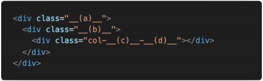

## 문제 1  CSS flex-direction

Q. Flex box의 주축을 변경하는 flex-direction의 4가지 값과 각각의 특징을 작성하시오.

A.

```python
row : 요소들을 가로로
row-reverse : 요소들을 가로로 배치하되 역순으로
column : 요소들을 세로로
column-reverse : 요소들을 세로 역순으로
```


## 문제 2  Bootstrap flex-direction

Q. flex-direction의 4가지 요소와 대응하는 bootstrap 클래스를 작성하시오.

A.

```python
row : flew-row
row-reverse : flex-row-reverse
column : flex-column
flex-column-recerse
```


## 문제 3 align-items

Q. align-items 속성의 4가지 값과 각각의 특징을 작성하시오.

A. 

```python
메인 축을 기준으로 (main-axis)
교차축(보조축)(cross-axis)에 적용

stretch : default
center : 보조축에서 가운데
start : 보조축의 첫번째
end : 보조축의 끝에
```


## 문제 4 flex-flow

Q. flex-flow 속성은 두가지 속성의 축약형이다. 올바르게 짝지어진 것을 고르시오

```python
(1) flex-direction, flex-wrap
(2) flex-direction, align-items
(3) justify-content, flex-wrap
(4) justify-content, align-items
```

A. 

`1번 flex-direction, flex-wrap`


## 문제 5 Bootstrap Grid System

Q.  하단 코드에 Bootstrap Grid System을 적용시키고자 할 때, __(a)__, __(b)__ 각각에 입력해야 할 클래스 이름을 작성하시오.



A.

`a : container`

`b : row`


## 문제 6 Breakpoint prefix

Q. Bootstrap Grid System에서 요소의 크기를 지정하기 위해서는 상단 코드와 같은 형태로 클래스 이름을 지정해야 한다.

1) __(c)__에 들어갈 수 있는 값과 그 값들이 가지는 의미를 작성하시오. 

2) __(d)__에 들어갈 수 있는 값과 그 값들이 가지는 의미를 작성하시오.

A.

`xs, sm, md, lg, xl, xxl` : breakpoint로 화면에 접속하는 기기의 환경(width)에 따라 어떤 화면을 보여줄지 설정

`1 ~ 12 `: 12 grid로 나눠져 있는 화면에서 얼마의 grid 만큼 차지해서 보여줄지 설정하는 값