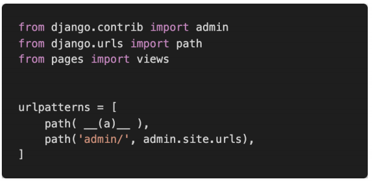
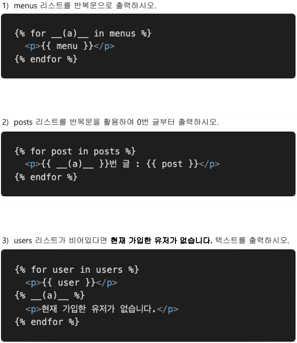
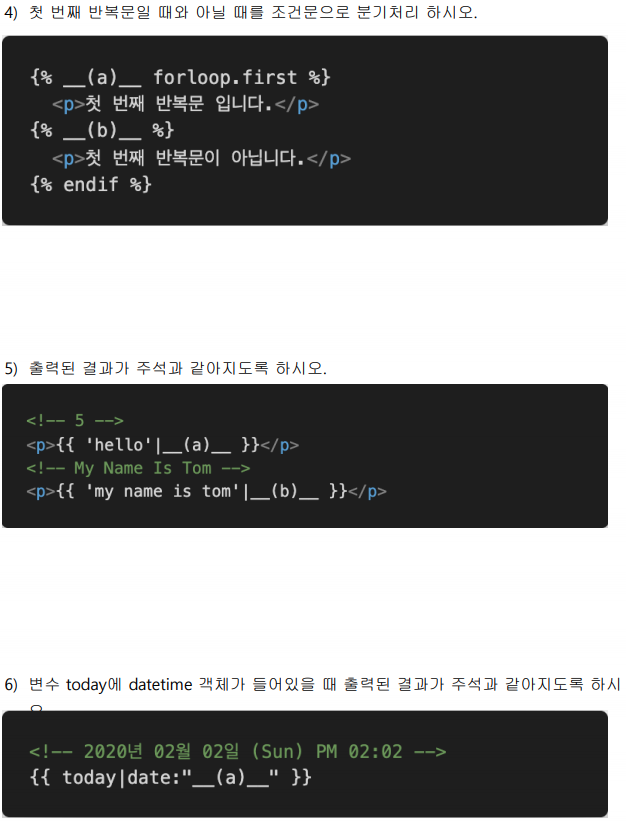
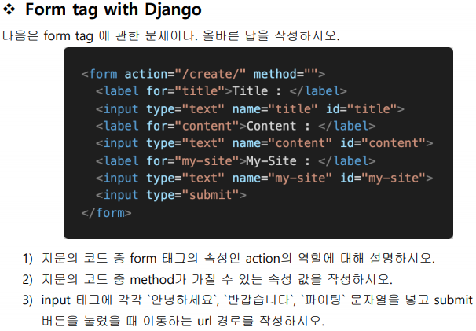

# 0308 homework

## 문제1

1-1. django 서버를 실행하고 첫 페이지에 접속했을 때 터미널에 출력된 서버 시간이 현재 한국 시간과 다른 시간으로 출력된다. 이를 한국 시간으로 바꾸려면 settings.py에 어떤 변 수 그리고 어떤 값을 할당해야 하는지 작성하시오. 

A. LANGUAGE_CODE = 'ko-kr'

1-2. 추가로 settings.py에 "이 변수"가 False인 상태로 1-1번 변수를 설정하는 것은 error라고 한다. "이 변수"는 무엇인가?

A.  DEBUG

아래 에러 메시지가 뜬다

CommandError: You must set settings.ALLOWED_HOSTS if DEBUG is False.

## 문제2

다음은 어떤 django 프로젝트의 urls.py의 모습이다. 주소 ’/ssafy’로 요청이 들어왔을 때 실 행되는 함수가 pages 앱의 views.py 파일 안 ssafy 함수라면, 요청에 응답하기 위해 빈칸 __(a)__에 추가되어야 할 코드를 작성하시오.

A. path('ssafy/', views.ssafy)

# Django Template Language

1번 답: menu

2번 답: forloop.counter0

3번 답: empty

4번 답: if, else

5번 답: length, title

6번 답: Y년 M월 d일 (D) A h:i

1) 입력 데이터가 전송될 URL 지정. 어디로 보낼건지/ 제출할 때 요청할 URL

2) 문자열의 title, content, my-site / 

##### `강사님 답`

method = GET(default), POST

어떤 method를 통해서 http url 요청을 하는가

get : 정보를 가져올 때(db에 아무 변화도 없을 때. 조회만 함)

post : db에 변화가 있을 때

지금은 db에 아무것도 없으므로 get 메소드만 가짐

3) form -> create -> server...? 휴웅,... 모르겠습니다으아..

#### `강사님 답`

url 구성은 name만 담당 ( id는 상관X )

/create/?title = 안녕하세요&content=반갑습니다&my-site=파이팅

