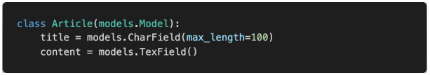

# 0310 homework

## 문제 1

`Q. “Django가 Model에 생긴 변화를 DB에 반영하는 방법”을 뜻하는 용어를 작성하시오.`

A. Migration


## 문제 2



`Q. 위에서 작성한 Model의 변경 사항을 저장하기 위한 명령어를 작성하시오. 이로 인해 생성 된 파일에 대응되는 SQL문을 확인하는 명령어와 출력 결과를 작성하시오`

A.

`변경사항 저장 : `

python manage.py makemigrations

`SQL문 확인 : `

python manage.py sqlmigrate articles 0001

```sql
CREATE TABLE "articles_article" (
	"id" integer NOT NULL PRIMARY KEY AUTOINCREMENT, 
	"title" varchar(10) NOT NULL, 
	"content" text NOT NULL
)
```


## 문제 3

`Q. Django에서 사용 가능한 모듈 및 메서드를 대화식 Python Shell에서 사용하려고 할 때, 어 떠한 명령어를 통해 해당 Shell을 실행할 수 있는지 작성하시오.`

A. python manage.py shell_plus


## 문제 4

`Q. Django에서 Model을 정의할 때 사용할 수 있는 필드 타입을 5가지 이상 작성하시오`

A. CharField, TextField, URLField, Value, Col