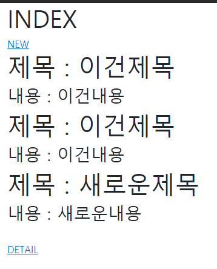
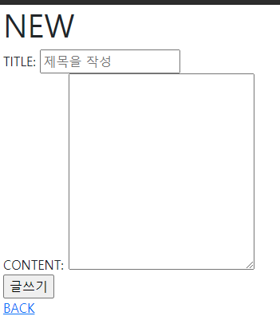

# 0310 workshop

1. index.html

```html



  <h1>INDEX</h1>
  <a href="">NEW</a>
  <br>
  
    <h1>제목 : {{ article.title }}</h1>
    <h3>내용 : {{ article.content }}</h3>
  
  <br>
  <a href="#">DETAIL</a>

```

2. new.html

```html



  <h1 class="text-center">NEW</h1>
  <form action="" method="GET">
    <label for="">TITLE:</label>
    <input type="text" name="title" placeholder="제목을 작성" id="title">
    <br>
    <label for="">CONTENT:</label>
    <textarea name="content" id="content" cols="30" rows="10"></textarea>
    <br>
    <input type="submit" value="글쓰기">
  </form>
  <a href="">BACK</a>

```

3. view.py

```python
from django.shortcuts import render, redirect
from .models import Article

# Create your views here.
def index(request):
    # 모든 게시글을 조회
    articles = Article.objects.all()
    context = {
        'articles': articles,
    }
    return render(request, 'articles/index.html', context)

def new(request):
    # article을 작성할 수 있는 양식을 보여주기만 하면 됨!
    return render(request, 'articles/new.html')

def create(request):
    title = request.GET.get('title')
    content = request.GET.get('content')
    article = Article()
    article.title = title
    article.content = content
    article.save()
    # articles = Article.objects.all()
    # context = {
    #     'articles':articles,
    # }
    return redirect('articles:index')

```

4. articles/urls.py

```python
from . import views
from django.urls import path

app_name = 'articles'
urlpatterns = [
    path('new/', views.new, name='new'),
    path('create/', views.create, name='create'),
    path('index/', views.index, name='index'),
]
```


## 결과사진



