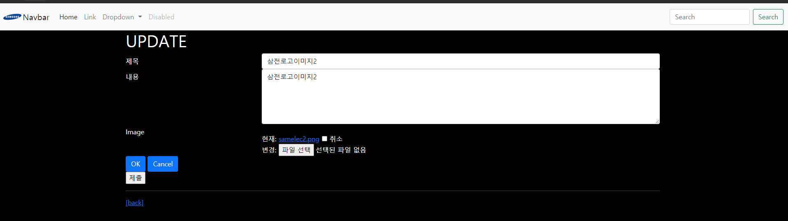

# 0318 workshop

## 결과페이지

1. `index`


2. `new`


3. `detail`


4. `update`




## Codes


`settings.py`

```python
"""
Django settings for crud project.

Generated by 'django-admin startproject' using Django 3.1.7.

For more information on this file, see
https://docs.djangoproject.com/en/3.1/topics/settings/

For the full list of settings and their values, see
https://docs.djangoproject.com/en/3.1/ref/settings/
"""

from pathlib import Path

# Build paths inside the project like this: BASE_DIR / 'subdir'.
BASE_DIR = Path(__file__).resolve().parent.parent


# Quick-start development settings - unsuitable for production
# See https://docs.djangoproject.com/en/3.1/howto/deployment/checklist/

# SECURITY WARNING: keep the secret key used in production secret!
SECRET_KEY = '%(+btt9tv$a*@)^r07dbjjgsn&zyuglqka9dw^h@9go7y&r$i&'

# SECURITY WARNING: don't run with debug turned on in production!
DEBUG = True

ALLOWED_HOSTS = []


# Application definition

INSTALLED_APPS = [
    'articles',
    'bootstrap5',
    'django.contrib.admin',
    'django.contrib.auth',
    'django.contrib.contenttypes',
    'django.contrib.sessions',
    'django.contrib.messages',
    'django.contrib.staticfiles',
]

MIDDLEWARE = [
    'django.middleware.security.SecurityMiddleware',
    'django.contrib.sessions.middleware.SessionMiddleware',
    'django.middleware.common.CommonMiddleware',
    'django.middleware.csrf.CsrfViewMiddleware',
    'django.contrib.auth.middleware.AuthenticationMiddleware',
    'django.contrib.messages.middleware.MessageMiddleware',
    'django.middleware.clickjacking.XFrameOptionsMiddleware',
]

ROOT_URLCONF = 'crud.urls'

TEMPLATES = [
    {
        'BACKEND': 'django.template.backends.django.DjangoTemplates',
        'DIRS': [BASE_DIR / 'crud' / 'templates',],
        'APP_DIRS': True,
        'OPTIONS': {
            'context_processors': [
                'django.template.context_processors.debug',
                'django.template.context_processors.request',
                'django.contrib.auth.context_processors.auth',
                'django.contrib.messages.context_processors.messages',
            ],
        },
    },
]

WSGI_APPLICATION = 'crud.wsgi.application'


# Database
# https://docs.djangoproject.com/en/3.1/ref/settings/#databases

DATABASES = {
    'default': {
        'ENGINE': 'django.db.backends.sqlite3',
        'NAME': BASE_DIR / 'db.sqlite3',
    }
}


# Password validation
# https://docs.djangoproject.com/en/3.1/ref/settings/#auth-password-validators

AUTH_PASSWORD_VALIDATORS = [
    {
        'NAME': 'django.contrib.auth.password_validation.UserAttributeSimilarityValidator',
    },
    {
        'NAME': 'django.contrib.auth.password_validation.MinimumLengthValidator',
    },
    {
        'NAME': 'django.contrib.auth.password_validation.CommonPasswordValidator',
    },
    {
        'NAME': 'django.contrib.auth.password_validation.NumericPasswordValidator',
    },
]


# Internationalization
# https://docs.djangoproject.com/en/3.1/topics/i18n/

LANGUAGE_CODE = 'ko-kr'

TIME_ZONE = 'Asia/Seoul'

USE_I18N = True

USE_L10N = True

USE_TZ = True


# Static files (CSS, JavaScript, Images)
# https://docs.djangoproject.com/en/3.1/howto/static-files/

STATIC_URL = '/static/'

STATICFILES_DIRS = [
    BASE_DIR / 'crud' / 'static',
]

# 사용자가 업로드한 파일을 모아 놓을 경로
MEDIA_ROOT = BASE_DIR / 'media'
MEDIA_URL = '/media/'
```


`urls.py`

```python
from django.contrib import admin
from django.urls import path, include
from django.conf import settings
from django.conf.urls.static import static

urlpatterns = [
    path('admin/', admin.site.urls),
    path('articles/', include('articles.urls')),
] + static(settings.MEDIA_URL, document_root=settings.MEDIA_ROOT)
```


`views.py`

```python
from django.shortcuts import render, redirect
from django.views.decorators.http import require_safe, require_http_methods, require_POST
from .models import Article
from .forms import ArticleForm

# Create your views here.
@require_safe
def index(request):
    # 모든 게시글을 조회

    # 1. DB로부터 받은 쿼리셋을 이후에 파이썬이 정렬 변경 (python이 조작)
    # articles = Article.objects.all()[::-1]

    # 2. 처음부터 원하는 정렬로 된 쿼리셋을 받음 (DB가 조작)
    articles = Article.objects.order_by('-pk')
    context = {
        'articles': articles,
    }
    return render(request, 'articles/index.html', context)


# 하나의 view 함수가 request의 method에 따라서 2가지 역할을 하게 됨
@require_http_methods(['GET', 'POST'])
def create(request):
    # POST일 때
    if request.method == 'POST':
        form = ArticleForm(data=request.POST)
        if form.is_valid():
            article = form.save()
            return redirect('articles:detail', article.pk)
    # GET일 때
    else:
        form = ArticleForm()
    context = {
        # 상황에 따른 2가지 모습
        # 1. is_valid에서 내려온 form : 에러메세지를 포함한 form
        # 2. else에서 내려온 form : 빈 form
        'form': form,
    }
    return render(request, 'articles/create.html', context)


@require_safe
def detail(request, pk):
    # 몇번 글을 조회할건지 가져와야 함
    article = Article.objects.get(pk=pk)
    context = {
        'article': article,
    }
    return render(request, 'articles/detail.html', context)


@require_POST
def delete(request, pk):
    # 삭제할 게시글 조회
    article = Article.objects.get(pk=pk)
    # 삭제 요청이 POST면 삭제, POST가 아니라면 DETAIL 페이지로 redirect
    article.delete()
    return redirect('articles:index')


@require_http_methods(['GET', 'POST'])
def update(request, pk):
    article = Article.objects.get(pk=pk)
    # update
    if request.method == 'POST':
        form = ArticleForm(request.POST, instance=article)
        if form.is_valid():
            form.save()
            return redirect('articles:detail', article.pk)
    # edit
    else:
        form = ArticleForm(instance=article)
    context = {
        'form': form,
        'article': article,
    }
    return render(request, 'articles/update.html', context)
```


`create.html`

```html



  <h1>CREATE</h1>
  <form action="" method="POST" enctype="multipart/form-data">
    
    {{ form.as_p }}
    <input type="submit">
  </form>

  <hr>

  <form action="" method="POST">
    
    
      
        
          <div class="alert alert-warning" role="alert"><strong>{{ error|escape }}</strong></div>
        
      
      {{ field.label_tag }}
      {{ field }}
    
    <input type="submit">
  </form>

  <a href="">[back]</a>


```


`index.html`

```html



  <h1>Articles</h1>
  <a href="">[CREATE]</a>
  <hr>
  
    <p>글 번호 : {{ article.pk }}</p>
    <p>글 제목 : {{ article.title }}</p>
    <p>글 내용 : {{ article.content }}</p>
    <a href="">[DETAIL]</a>
    <hr>
  


```


`update.html`

```html




  <h1>UPDATE</h1>
  <form action="" method="POST">
    
    
      

    
    

     
        <button type="submit" class="btn btn-primary">Submit</button>
     

    <input type="submit">
  </form>
  <hr>
  <a href="">[back]</a>


```


`detail.html`

```html




<link rel="stylesheet" href="">




  <h2>DETAIL</h2>
  <h3>{{ article.pk }} 번째 글</h3>
  <hr>
  <p>제목 : {{ article.title }}</p>
  <p>내용 : {{ article.content }}</p>
  
  
  
  
  <p>작성시각 : {{ article.created_at }}</p>
  <p>수정시각 : {{ article.updated_at }}</p>
  <hr>
  <a href="" class="btn btn-primary">[UPDATE]</a>
  <form action="" method="POST">
    
    <button class="btn btn-danger">DELETE</button>
  </form>
  <a href="">[back]</a>


```


`detail.css`

```css
h2 {
  text-align: center;
}
```


`base.css`

```css
body {
  background-color: black;
  color: white;
}

/* img {
  width: 100px;
  height: 100px;
} */
```


