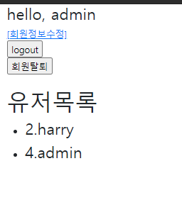
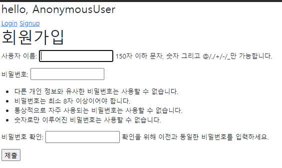

# 0322 workshop

## 문제1

> /accounts/

유저 목록을 출력하는 페이지를 나타낸다

`urls.py`

```python
from django.urls import path
from . import views

app_name = 'accounts'
urlpatterns = [
    path('login/', views.login, name='login'),
    path('logout/', views.logout, name='logout'),
    path('signup/', views.signup, name='signup'),
    path('delete/', views.delete, name='delete'),
    path('update/', views.update, name='update'),
    path('', views.index, name='index'),
]
```


`views.py`

```python
from django.contrib.auth import get_user_model

# Create your views here.
def index(request):
    userlist = get_user_model()
    users = userlist.objects.all()
    context = {
        'users':users,
    }
    return render(request, 'accounts/index.html', context)
```


`index.html`

```



<br>
<h1>유저목록</h1>
<ul>

<li><h3> {{user.pk}}.{{ user.username }}</h3></li>

</ul>



```


`결과화면`



## 문제2

회원가입 작성을 위한 페이지를 나타낸다. 유저를 생성하는 기능을 수행한다.

`views.py`

```python
def signup(request):
    # 로그인한 사용자는 회원가입 페이지로 들어오지 못하게
    if request.user.is_authenticated:
        return redirect('articles:index')

    if request.method == 'POST':
        # 모델폼이다. request에서 받아온 데이터가 먼저 들어가야함
        form = UserCreationForm(request.POST)
        if form.is_valid():
            user = form.save()
            # 회원가입 하고나면 로그인이 자동으로 되어야 함
            # 로그인 세션을 만들고 로그인시켜주는 애가 필요
            ### auth_login(request, form.get_user())
            # 근데 다만 get_user()는 authenticationForm의 메소드임
            # 여기서는 자동안함
            # 그럼 어떤 메소드를 줘야 하는지 구글 검색하셈
            # 검색 결과 save() 호출하면 리턴은 user 객체다
            # 그러니까 user를 넣어주면 로그인도 해줄 것이다
            auth_login(request, user)
            return redirect('articles:index')
    else:
        form = UserCreationForm()
    context = {
        'form':form,
    }
    return render(request, 'accounts/signup.html', context)
```


`결과화면`

