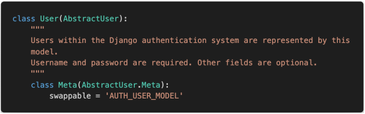
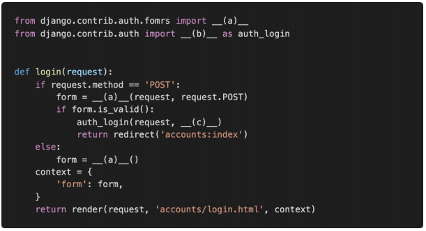
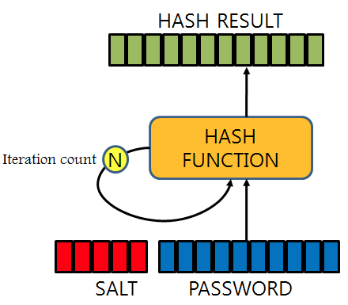

# 0323 homework

## 문제1

django에서 기본적으로 사용하는 User 모델은 AbstractUser 모델을 상속받아 정의된다.



아래의 models.py를 참고하여 User 모델에서 사용할 수 있는 칼럼 중 BooleanField 로 정의 된 컬럼을 모두 작성하시오.

A.

> - is_staff
> - is_active


## 문제2

django에서 기본적으로 사용하는 User 모델의 username 컬럼이 저장할 수 있는 최대 길이를 작성하시오.

A.

> max_length=150

```python
class AbstractUser(....)
    username = models.CharField(
            _('username'),
            max_length=150,
            unique=True,
            help_text=_('Required. 150 characters or fewer. Letters, digits and @/./+/-/_ only.'),
            validators=[username_validator],
            error_messages={
                'unique': _("A user with that username already exists."),
            },
        )
```


## 문제3

단순히 사용자가 ‘로그인 된 사용자인지’만을 확인하기 위하여 User 모델 내부에 정의된 속성의 이름을 작성하시오.

A.

> is_authenticated


## 문제4

다음은 로그인 기능을 구현한 코드이다. 빈 칸에 들어갈 코드를 작성하시오.



A.

> (a) : AuthenticationForm
>
> (b) : login
>
> (c) : form.get_user()


## 문제5

로그인을 하지 않았을 경우 template에서 user 변수를 출력했을 때 나오는 클래스의 이름을 작성하시오.

A.

>  AnonymousUser


## 문제6

Django에서 기본적으로 User 객체의 password 저장에 사용하는 알고리즘, 그리고 함께 사용된 해시 함수를 작성하시오.

A.

> 알고리즘 : PBKDF2 algorithm
>
> 해시함수 : SHA256 hash


#### 번외

---

##### `PBKDF2 (Password-Based Key Derivation Function)`

사용자의 암호를 저장할 때 SALT라는 임의의 문자열을 PASSWORD에 붙여 DIGEST를 만든다고 한다. 만약 해킹을 시도해 암호를 알아내려면 이 DIGEST와 비교했을 때 일치해야 하므로 임의의 문자열이 뭔지 알아내야 한다.

하지만 이 방법도 HW의 연산이 빠르면 취약한 점이 있다고 한다.

그래서 이 DIGEST를 만드는 해싱을 임의의 횟수 N번을 해서 저장하는 방식이 PBKDF2다.

구현이 쉽고, 보안성이 뛰어나 미국표준기술연구소(NIST)에서도 승인한 알고리즘이다.



`DIGEST = PBKDF2(PRF, Password, Salt, c, DLen)  `

- PRF: 난수(예: HMAC)
- Password: 패스워드
- Salt: 암호학 솔트
- c: 원하는 iteration 반복 수
- DLen: 원하는 다이제스트 길이

위와 같은 파라미터가 필요한데, 위의 c가 임의의 횟수로 반복적인 해싱을 일어나게 만드는 파라미터다. 기본적으로 1000번? 이상 해준다고 함

여기서 `해싱`은 임의의 크기를 가진 데이터를 고정된 크기로 변환시키는 알고리즘인데 앞에 SALT와 PASSWORD를 합쳐 DIGEST를 만들 때 고정된 크기의 DIGEST를 만들기 위한 변환 과정이라고 이해했는데 맞는지는 모르겠다.


## 문제7

로그아웃 기능을 구현하기 위하여 다음과 같이 코드를 작성하였다. 로그아웃 기능을 실행 시 문제가 발생한다고 할 때 그 이유와 해결 방법을 작성하시오

```python
def logout(request):
    logout(request)
    return redirect('accounts:login')
```

A.

Django에서 제공하는 로그아웃폼(logout)이 함수 이름과 같아서 충돌이 일어난다.

방법은 두가지가 있는데

> 1. 함수이름을 다른거로 바꾸기
> 2. 로그아웃폼을 불러올 때 as를 써서 다른 이름으로 사용하기

###### `1번방법`

```python
from django.contrib.auth import logout

def logout_auth(request):
    logout(request)
    return redirect('accounts:login')
```

하지만 이 방법은 url과 템플릿도 함수 이름과 같은 이름으로 만들어줘야하는 불편함이 있다.

그러므로 두번째 방법을 권장하고 있다.


###### `2번방법`

```python
from django.contrib.auth import logout as auth_logout

def logout(request):
    auth_logout(request)
    return redirect('accounts:login')
```


