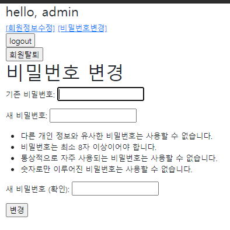

# 0323 workshop

/accounts/password/ url을 가지며 유저의 비밀번호 수정 기능을 구현한다


#### `urls.py`

```python
app_name = 'accounts'
urlpatterns = [
    path('login/', views.login, name='login'),
    path('logout/', views.logout, name='logout'),
    path('signup/', views.signup, name='signup'),
    path('delete/', views.delete, name='delete'),
    path('update/', views.update, name='update'),
    path('', views.index, name='index'),
    # 비밀번호 수정 기능
    path('password/', views.password, name='password'),
]
```


#### `views.py`

```python
from django.contrib.auth import update_session_auth_hash
from django.contrib.auth.forms import PasswordChangeForm

@login_required
def password(request):
    if request.method == 'POST':
        form = PasswordChangeForm(request.POST, instance=request.user)
        if form.is_valid():
            users = form.save()
            update_session_auth_hash(request, users)
            return redirect('accounts:index')
    else:
        form = PasswordChangeForm(request.user)
    context = {
        'form':form,
    }
    return render(request, 'accounts/password.html', context)
```


#### `password.html`

```html


<h1>비밀번호 변경</h1>
<form action="" method='POST'>

{{ form.as_p }}
<input type="submit" value="변경">
</form>

```


#### `결과화면`

