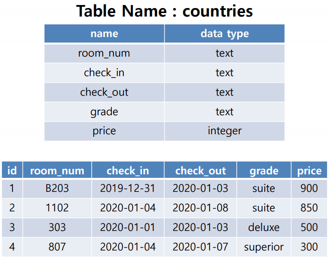

# 0325 workshop




## 문제 1

>  `countries 테이블을 생성하시오.`

A.

```sqlite
CREATE TABLE countries (
  room_num text,
  check_in text,
  check_out text,
  grade text,
  price integer
);
```


## 문제 2

> `데이터를 입력하시오.`

A.

```sqlite
insert into countries values
('B203', '2019-12-31', '2020-01-03', 'suite', 900),
('1102', '2020-01-04', '2020-01-08', 'suite', 850),
('303', '2020-01-01', '2020-01-03', 'deluxe', 500),
('807', '2020-01-04', '2020-01-07', 'superior', 300);
```


## 문제 3

>  `테이블의 이름을 hotels로 변경하시오.`

A.

```sqlite
alter table countries rename to hotels;
```


## 문제 4

> `객실 가격을 내림차순으로 정렬하여 상위 2개의 room_num과 price를 조회하시오.`

A.

```sqlite
select room_num, price from hotels order by price limit 2;
```


## 문제 5

> ` grade 별로 분류하고 분류된 grade 개수를 내림차순으로 조회하시오.`

A.

```sqlite
select grade, count(*) as grade_cnt from hotels group by grade order by grade_cnt desc;
```


## 문제 6

>  `객실의 위치가 지하 혹은 등급이 deluxe인 객실의 모든 정보를 조회하시오.`

A.

```sqlite
select * from hotels where room_num like 'B%' or grade='deluxe';
```


## 문제 7

>  `지상층 객실이면서 2020년 1월 4일에 체크인 한 객실의 목록을 price 오름차순으로 조회하시오`

A.

```sqlite
select room_num from hotels where room_num not like 'B%' and check_in='2020-01-04' order by price;
```


