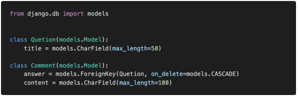
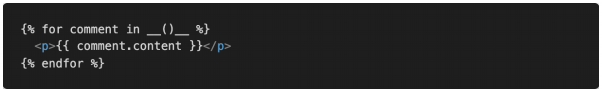
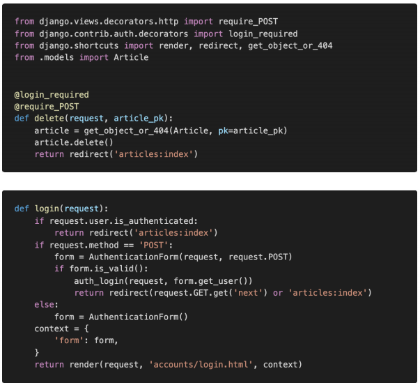

# 0329 homework

## 문제 1

1:N True or False 각 문항을 읽고 맞으면 T, 틀리면 F를 작성하고 틀렸다면 그 이유도 함께 작성하시오. 

> 1) ForeignKey는 부모 테이블의 데이터를 참조하기 위한 키이다. 
>
> - True
>
> 2) 1:N 관계에서 1은 N의 데이터를 직접 참조 할 수 있다. 
>
> - False : 역참조
>
> 3) on_delete 속성은 ForeignKey 필드의 필수 인자이다. 
>
> - True
>
> 4) 1:N 관계에서 외래 키는 반드시 부모 테이블의 PrimaryKey여야 한다.
>
> - False : 유일한 값이면(Unique 하면) PK가 아니어도 상관없다.


## 문제 2

다음과 같이 이름이 articles인 app의 models.py에 작성된 코드를 바탕으로 테이블이 만들어 졌을 때, 데이터베이스에 저장되는 ForeignKey 컬럼의 이름과 테이블의 이름이 무엇인지 작성하시오



A.

> 컬럼이름 : answer_id
>
> 테이블이름 : articles_comment


## 문제 3

위 2번 문제 모델 관계를 바탕으로 어느 template 페이지가 다음과 같이 작성되어 있을 때, 질문(Question)에 작성된 모든 댓글(Comment)을 출력하고자 한다. 해당 template에서 Question 객체를 사용할 수 있다면 빈칸 __(a)__에 들어갈 알맞은 코드를 작성하시오



A.

> Question.comment_set.all


## 문제 4

다음과 같이 게시글을 삭제하는 delete 함수와 로그인을 위한 login 함수가 작성되어 있다.  만약 비로그인 사용자가 삭제를 시도한다면 django는 해당 사용자를 url에 next 파라미터가 붙은 login 페이지로 redirect 한다.

 ▪ /accounts/login/?next=/articles/1/delete/ 


1) redirect된 로그인 페이지에서 로그인에 성공했을 때 발생하는 HTTP response status  code를 작성하고 발생한 원인과 해결을 위해 코드를 수정하시오. 

▪ 게시글 삭제는 HTTP POST method로만 가능하다. 

▪ 인증되지 않은 사용자는 메인페이지로 redirect 되어야 한다



A.

> 405에러
>
> 원인 : login_required에 의해서 로그인 페이지로 돌아가게 되면 마지막에 redirect(request.GET.get('next'))에 의해서 get방식으로 원래의 delete 페이지로 돌아가게 된다. 그렇기 때문에 delete 함수의 require_POST와 충돌해 에러가 나게 된다
>
> 해결 : login_required를 지우고 is_authenticated 속성으로 대체한다.

```python
@require_POST
def delete(request):
    if request.user.is_authenticated:
        request.user.delete()
        auth_logout(request)
    return redirect('articles:index')
```


