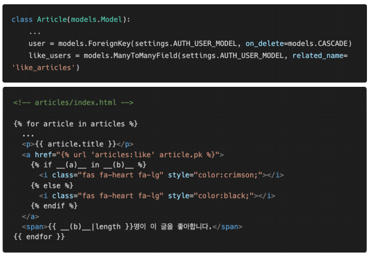
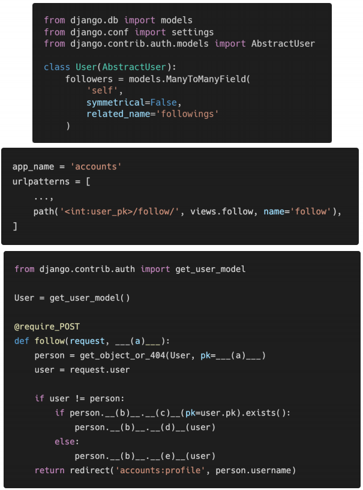
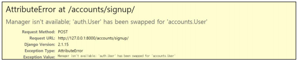
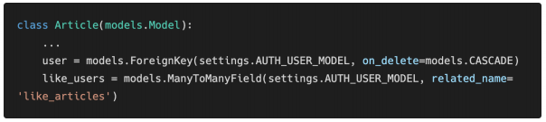
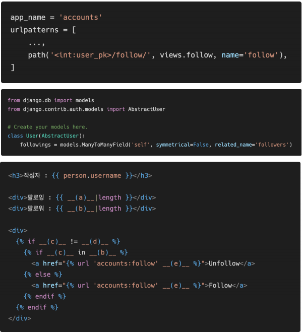

# 0331 homework

## 문제 1

##### `각 문항을 읽고 맞으면 T, 틀리면 F를 작성하고 틀렸다면 그 이유도 함께 작성하시오.`

>1) Django에서 1:N 관계는 ForeignKeyField를 사용하고 M:N 관계는 ManyToManyField를 사용한다.
>
>- `True`
>
>2) ManyToManyField를 설정하고 만들어지는 테이블 이름은 “앱이름_클래스이름_지정한 필드이름”의 형태로 만들어진다. 
>
>- `True`
>
>3) ManyToManyField의 첫번째 인자는 참조할 모델, 두번째 인자는 related_name이 작성되는데 두 가지 모두 필수적으로 들어가야 한다.
>
>- `False` : related_name 인자는 해당 테이블이 이미 같은 테이블을 참조하고 있을 때, 역참조 호출명의 중복을 피해주기 위해서 사용한다.


## 문제 2

##### `아래 빈 칸 (a)와 (b)에 들어갈 코드를 각각 작성하시오`



> (a) : request.user
>
> (b) : article.like_users.all


## 문제 3

##### `모델 정보가 다음과 같을 때 빈칸 (a)와 (b)에 들어갈 코드를 각각 작성하시오`




> (a) : user_pk
>
> (b) : followers
>
> (c) : filter
>
> (d) : remove
>
> (e) : add


## 문제 4

##### `아래와 같은 에러 메시지가 발생하는 이유와 이를 해결하기 위한 방법과 코드를 작성하시오. `



> `발생 이유`
>
> - 회원가입에 필요한 모델폼 UserCreationForm이 기본 유저모델 auth.User를 참조하는데, 이미 커스텀 유저 모델(accounts.User)을 정의했기 때문에 둘이 충돌..? 이 일어난다.
>
> `해결 방법`
>
> - UserCreationForm을 재정의 해야 한다. 
> - 이때 model은 현재 활성화된 유저를 사용하기 위해 get_user_model()로 정의한다
>
> ```python
> from django.contrib.auth.forms import UserCreationForm
> from django.contrib.auth import get_user_model
> 
> class CustomUserCreationForm(UserCreationForm):
> 
>     class Meta(UserCreationForm.Meta):
>         model = get_user_model()
>         fields = UserCreationForm.Meta.fields
> ```


## 문제 5

##### `아래의 경우 related_name을 필수적으로 설정해야 한다. 그 이유를 설명하시오. `



> related_name 인자는 해당 테이블이 이미 같은 테이블을 참조하고 있을 때, 역참조 호출명의 중복을 피해주기 위해서 사용한다.


## 문제 6

##### `person 변수에는 view함수에서 넘어온 유저 정보가 담겨 있고, `

##### `모델 정보가 아래와 같을 때 `

##### `빈칸 a, b, c, d, e에 들어갈 알맞은 코드를 각각 작성하시오`




> (a) : person.followings.all
>
> (b) : person.followers.all
>
> (c) : request.user
>
> (d) : person
>
> (e) : person.pk