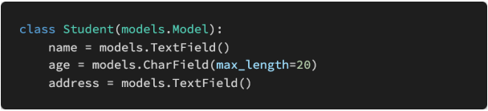

# 0426 homework

## 문제 1

아래의 설명을 읽고 T/F 여부를 작성 후 이유를 설명하시오. 

- URI는 정보의 자원을 표현하고, 자원에 대한 행위는 HTTP Method로 표현한다.

  > True

- HTTP Method는 GET과 POST 두 종류가 있다. 

  > False
  >
  > - HTTP Method 종류 : GET, POST, PUT, DELETE

- 일반적으로 URI 마지막에 슬래시( / )는 포함하지 않는다.

  > True

- ‘https://www.fifa.com/worldcup/teams/team/43822/create/’는 계층 관계를 잘 표현 한 RESTful한 URI라고 할 수 있다.

  > False. create 동사가 들어가 있고, teams와 team이 겹치므로 별로 좋지 않은 표현


## 문제 2

다음의 HTTP status code의 의미를 간략하게 작성하시오

>- `200` : OK. 요청이 성공적으로 완료
>- `400` : Bad Request. 잘못된 문법으로 인하여 서버가 요청을 이해할 수 없음
>- `401` : Unauthorized. 유효하지 않은 자격 증명으로 요청이 적용되지 않음 (예: 로그인 안하고 좋아요를 눌렀을 때)
>- `403` : Forbidden. 서버에서 클라이언트가 누군지는 알고 있으나 승인되지 않음 (예: 내가 작성하지 않은 글을 삭제하려 할 때)
>- `404` : Not Found. 잘못된 URL
>- `500` : Internal Server Error. 서버 내부 오류


## 문제 3

serializers.py 파일에 StudentSerializer를 작성하시오.



```python
from rest_framework import serializers
from .models import Student

class StudentSerializer(serializers.ModelSerializer):
    
    class Meta:
        model = Student
        fields = '__all__'
    
```


## 문제 4

Serializers의 의미를 DRF(Django REST Framework) 공식 문서를 참고하여 간단하게 설명하시오

> `serializer`: 모델 인스턴스를 우리가 사용하기 좋게끔 바꿔준다
>
> ex) dict, list + 유효성검사