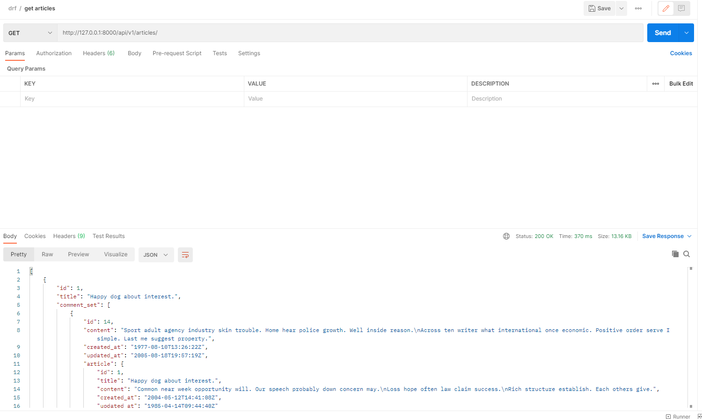
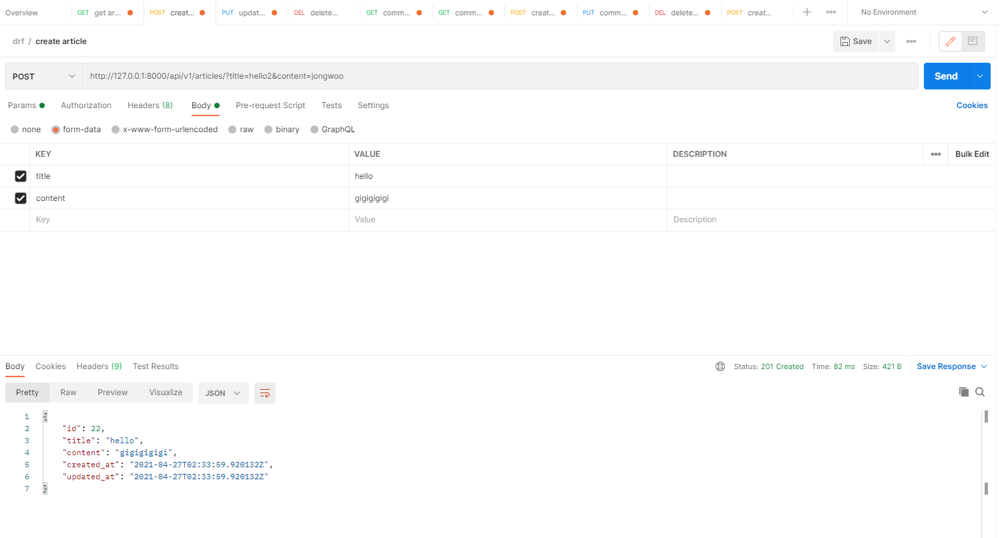
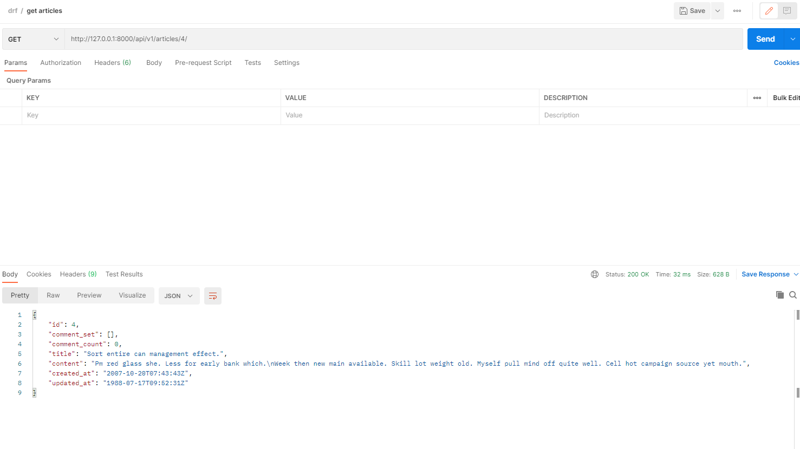
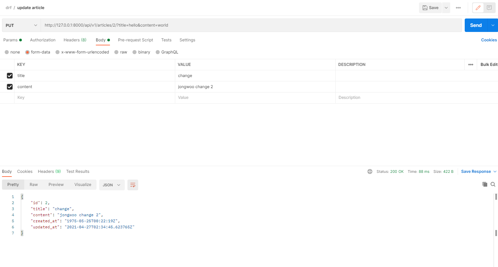
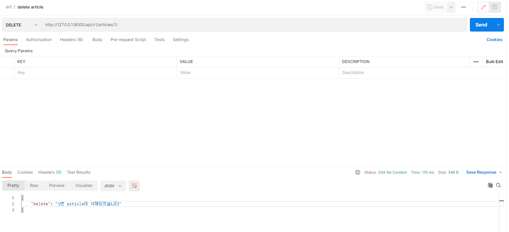

# 0427 workshop

##### `views.py`

```python
from rest_framework.response import Response
from rest_framework.decorators import api_view
from rest_framework import status
from django.shortcuts import render, get_list_or_404, get_object_or_404

from .models import Article, Comment
from .serializers import (
    ArticleSerializer, 
    ArticleDetailSerializer, 
    CommentSerializer
)

# Create your views here.

# REST FRAMEWORK 디자인 : 항상 어떤 메소드로 받아오는지 지정해줘야 한다!
@api_view(['GET', 'POST'])
def article_list(request):
    if request.method == 'GET':
        # 1. article을 모두 가져와서
        # articles = Article.objects.all() # 빈 배열 그대로 보여주려면 이거 쓰셈!
        articles = get_list_or_404(Article) # 빈 배열이면 404 리턴
        # 2. json 파일로 변환해서
        serializer = ArticleSerializer(articles, many=True) # articles는 여러 객체이므로 쿼리셋이다. 근데 serializer는 기본적으로 하나만 json으로 바꿔준다. 그러므로 many 인자를 넣어야 함!
        # 3. 서버에 응답한다(Response 내에는 딕셔너리 객체가 들어간다)
        return Response(serializer.data)

    elif request.method == 'POST':
        # 해야할 일
        # 1. 사용자가 보낸 data를
        # 2. serializer에 넣어서 검증! (예전에는 이게 form 이었다!)
        # 3. 검증 통과하면 저장
        serializer = ArticleDetailSerializer(data=request.data)
        if serializer.is_valid(raise_exception=True): # raise_exception : 유효하지 않은 객체에 대해 BAD REQUEST를 리턴한다. 맨 밑 코드와 같은 동작.
            serializer.save()
            return Response(serializer.data, status=status.HTTP_201_CREATED) # 새로 저장한 결과를 보여준다. 이건 자기 맘대로 할 수 있음!(ex. {'result':'saved!'}) 다만 꼭 뭐든 return해줘야 함!
        return Response(serializer.errors, status=status.HTTP_400_BAD_REQUEST)


@api_view(['GET', 'PUT', 'DELETE'])
def article_detail(request, article_pk):
    article = get_object_or_404(Article, pk=article_pk)
    if request.method == 'GET':
        # 1. article_pk에 맞는 모델 인스턴스를 가져와서
        # article = Article.objects.get(pk=article_pk)
        # article = get_object_or_404(Article, pk=article_pk)
        # 2. 변환하고
        serializer = ArticleDetailSerializer(article) # 이번에는 객체가 하나니까 many 인자 안줘도 됨!
        # 3. 응답한다
        return Response(serializer.data)

    elif request.method == 'PUT': # 수정에 대한 요청
        # 1. 사용자의 데이터와, 기존 모델 인스턴스를 통해서
        # 2. serializer를 만들고
        # 3. 검증하고
        # 4. 저장하고
        # 5. 응답한다
        serializer = ArticleDetailSerializer(article, data=request.data) # (instance=article, data=request.data) 이렇게 써도 됨
        if serializer.is_valid(raise_exception=True):
            serializer.save()
            return Response(serializer.data)
        # return Response(serializer.errors, status=status.HTTP_400_BAD_REQUEST)
    elif request.method == 'DELETE':
        # article 삭제하고
        # 응답한다
        article.delete()
        data = {
            'delete': f'{article_pk}번 article이 삭제되었습니다',
        }
        return Response(data, status=status.HTTP_204_NO_CONTENT)


@api_view(['GET'])
def comment_list(request):
    # 1. 모든 comment를 불러와서
    # 2. 적절히 변환하여
    # 3. 응답한다
    comments = get_list_or_404(Comment)
    # comments = Comment.objects.all()
    serializer = CommentSerializer(comments, many=True)
    return Response(serializer.data)


@api_view(['GET','PUT','DELETE'])
def comment_detail(request, comment_pk):
    comment = get_object_or_404(Comment, pk=comment_pk)
    if request.method == 'GET':
        # comment = get_object_or_404(Comment, pk=comment_pk)
        serializer = CommentSerializer(comment)
        return Response(serializer.data)

    elif request.method == 'PUT':
        serializer = CommentSerializer(comment, request.data)
        if serializer.is_valid(raise_exception=True):
            serializer.save()
            return Response(serializer.data)
        

    elif request.method == 'DELETE':
        comment.delete()
        data = {
            'delete': f'{comment_pk}번 comment가 삭제되었습니다',
        }
        return Response(data, status=status.HTTP_204_NO_CONTENT)


@api_view(['POST'])
def comment_create(request, article_pk):
    # 첫번째 방법
    # request.data에 article 정보가 들어있음!
    # 시리얼라이저 만들고, 검증, 저장, 응답!
    # serializer = CommentSerializer(data=request.data)
    # if serializer.is_valid(raise_exception=True):
    #     serializer.save()
    #     return Response(serializer.data)

    # 두번째 방법
    # url에 작성된 article_pk를 이용하는 방법!
    article = get_object_or_404(Article, pk=article_pk)
    serializer = CommentSerializer(data=request.data)
    if serializer.is_valid(raise_exception=True):
        serializer.save(article=article)
        return Response(serializer.data)

```


##### `serializer.py`

```python
# serializer : 모델 인스턴스를 우리가 사용하기 좋게끔 바궈준다
# ex) dict, list + 유효성검사

from rest_framework import serializers
from .models import Article, Comment

class CommentSerializer(serializers.ModelSerializer):

    class Meta:
        model = Comment
        fields = '__all__'
        read_only_fields = ('article',)


class ArticleSerializer(serializers.ModelSerializer):
    # comment_set = CommentSerializer(many=True, read_only=True)

    class Meta:
        model = Article
        fields = ('id', 'title', 'comment_set')
        depth = 2


class ArticleDetailSerializer(serializers.ModelSerializer):
    comment_set = CommentSerializer(many=True, read_only=True) # read_only는 유효성검사에는 들어가지 않고 오직 읽을 때만 사용
    comment_count = serializers.IntegerField(
        source='comment_set.count', 
        read_only=True
    )

    class Meta:
        model = Article
        fields = '__all__'

```


##### `GET`




##### `POST`



##### `GET 특정게시물`




##### `PUT`




##### `DELETE`




