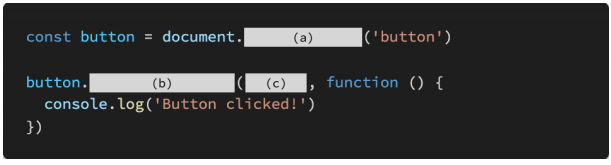

# 0428 homework

## 문제 1

아래의 설명을 읽고 T/F 여부를 작성하시오. 

- document.createElement 메서드를 통해 HTML 요소를 생성할 수 있다

  > True

- EventTarget.addEventListener(type, listener)에서 listener에 작성되는 콜백 함수의 첫번째 매개변수는 발생한 이벤트를 설명하는 Event에 기반한 객체이다

  > True

- event.preventDefault 메서드를 통해 이벤트 동작을 취소할 수 있다

  > True

- 부모 노드에서 자식 노드를 추가하는 유일한 방법은 append 메서드 뿐이다

  > False. append, appendChild, insertBefore 등이 있다

## 문제 2

DOM Event에는 다양한 종류의 Event가 존재한다.  

아래 제시된 Event들이 각각 어떤 시점에 발생하는지 다음 MDN 문서를 참고하여 간단하게 작성하시오.  

###### `click, mouseover, mouseout,, keydown, keyup, load, scroll, change, input`

> - click : 객체를 클릭했을 때
> - mouseover : 마우스 커서가 해당 객체 위에 있을 때
> - mouseout : 마우스 커서가 해당 객체에 있다가 밖으로 이동했을 때
> - keydown : 키보드 키가 눌렸을 때
> - keyup : 키보드 키에서 손 뗏을 때
> - load : 로딩이 끝났을 때
> - scroll : 스크롤 했을 때
> - change : input, select, textarea 태그 요소의 값이 변했을 때. input 이벤트와 달리 변화의 모든 과정에서 이벤트가 일어나진 않는다
> - input : input, select, textarea 태그 요소의 값이 변했을 때. 값이 변하는 모든 과정에서 이벤트 발생

## 문제 3

다음은 버튼을 클릭했을 때, 콘솔창을 통해 메시지를 확인하는 코드이다. (a), (b), (c)에 들어갈 코드를 작성하시오.

> (a) : querySelector
>
> (b) : addEventListener
>
> (c) : 'click'