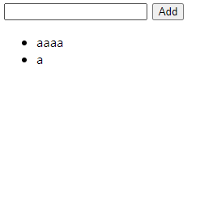

# 0428 workshop

```html
<!DOCTYPE html>
<html lang="en">
<head>
  <meta charset="UTF-8">
  <meta http-equiv="X-UA-Compatible" content="IE=edge">
  <meta name="viewport" content="width=device-width, initial-scale=1.0">
  <title>Document</title>
</head>
<body>

  <form action="#" id="to-do">
    <input type="text">
    <input type="submit" value="Add">
  </form>

  <script>
    const formTag = document.querySelector('#to-do')
    const ul = document.createElement('ul')
    const body = document.querySelector('body')
    body.appendChild(ul)
    formTag.addEventListener('submit', function (event) {
      console.log(event)
      const myLitag = document.createElement('li')
      myLitag.innerText = event.srcElement[0].value
      if (myLitag.innerText.length > 0) { 			// 빈 칸 제출하면 글 추가 안됨
        ul.append(myLitag)
        event.srcElement[0].value = ''
      }
      console.log(myLitag)
    })

  </script>
</body>
</html>
```


