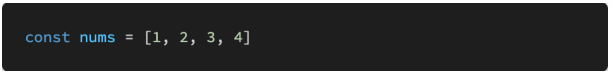

# 0429 homework

## 문제 1

아래의 설명을 읽고 T/F 여부를 작성하시오. 

- let & const 키워드로 선언한 변수와 var 키워드로 선언한 변수의 유일한 차이점은 변수의 유효범위이다.

  > False. 다른 차이점 중 하나로 let은 값 변경 가능, const는 불가능하다

- “값이 없음”을 표현하는 값으로 null과 undefined 두 종류가 있으며, 둘 다 typeof 연산자에서 undefined가 반환된다.

  > True. (null은 object 반환)

- for in 문을 통해 배열의 각 요소를 순회할 수 있다.

  > True. but 하지 마라. for of를 쓰는게 낫다

- ‘==’ 연산자는 두 변수의 값과 타입이 같은지 비교하고 같다면 true 아니면 false 를 반환한다.

  > False. 두 타입이 달라도 형변환을 일으켜 비교한다. 타입까지 비교하려면 === 을 써야 한다

- JavaScript에서 함수는 변수에 할당, 인자로 전달할 수 있으나 함수의 결과값으로 반 환할 수는 없다

  >True

## 문제 2

다음의 Array Helper Method의 동작을 간략히 서술하시오. (예) forEach - 배열의 요소를 하나씩 순회한다.)

- map : 모든 인자에 규칙을 적용해 만든 배열을 return
- filter : 배열에서 규칙에 부합하는 인자로 이루어진 배열을 return
- find : 배열에서 특정 값의 인자를 찾는 메소드
- every : 내가 전달한 조건을 전부 만족하는지. boolean
- some : 내가 전달한 조건을 하나라도 만족하는지. boolean
- reduce : 순회한 요소를 가지고 하나의 값으로 만들어줌

## 문제 3

아래의 숫자 배열에 map 함수를 사용하여, 모든 아이템에 3제곱을 한 새로운 배열을 만드는 코드를 작성하시오

> nums.map((num) => {
>
> ​	return num * num * num
>
> })