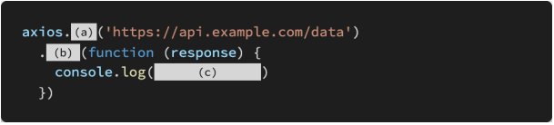

# 0503 homework

## 문제 1

- JavaScript는 single threaded 언어로 한번에 한가지 일 밖에 처리하지 못한다

  > True

- setTimeout은 브라우저의 Web API를 사용하는 함수로, Web API에서 동작이 완료 되면 Call Stack에 바로 할당된다

  > False. call back Queue에 담겼다가 Call Stack이 비어있게 되면 event loop가 돌아서 할당하게 된다

- Promise 객체를 생성할 때 인자로 받는 callback 함수인 resolve와 reject는 비동기 처리가 성공/실패 했을 경우 어떠한 값을 전달할지 결정한다

  > True

- Promise 객체의 .then 메서드는 오류 없이 resolve 되었을 때 실행되는 함수이 며, .catch 메서드는 도중에 오류가 발생하여 reject 되었을 때 실행되는 함수이다.

  > True

## 문제 2

JavaScript에서 동기와 비동기 함수의 차이점을 서술하시오.

A.

> 코드에 대한 결과를 기다리느냐 안기다리느냐
>
> - 동기 함수 : 코드에 대한 결과가 나올 때까지 기다림
> - 비동기 함수 : 코드에 대한(요청에 대한) 결과를 기다리지 않고 다음으로 넘어감

## 문제 3

다음은 axios를 사용하여 API 서버로 요청을 보내고, 응답 데이터를 출력하는 코드이다. (a), (b), (c)에 들어갈 코드를 작성하시오

> (a) : get
>
> (b) : then
>
> (c) : response.data