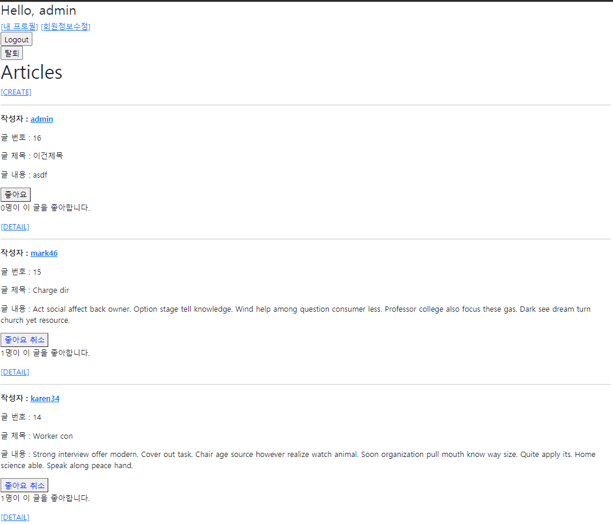

# 0504 workshop

## 코드	

#### `index.html`

```ht



  <h1>Articles</h1>
  
    <a href="">[CREATE]</a>
  
    <a href="">[새 글을 작성하려면 로그인하세요.]</a>
  
  <hr>
  
    <p>
      <b>작성자 : <a href="">{{ article.user }}</a></b>
    </p>
    <p>글 번호 : {{ article.pk }}</p>
    <p>글 제목 : {{ article.title }}</p>
    <p>글 내용 : {{ article.content }}</p>
    <div>
      <form class="like-form" data-id="{{article.pk}}" method="POST">
        
        
          <button style="color: blue;" id="like-btn-{{article.pk}}">좋아요 취소</button>
        
          <button style="color: black;" id="like-btn-{{article.pk}}">좋아요</button>
        
      </form>
    </div>
    <p>
      <span id="like-count-{{article.pk}}">{{ article.like_users.all|length }}</span>명이 이 글을 좋아합니다.
    </p>
    <a href="">[DETAIL]</a>
    <hr>
  



<!DOCTYPE html>
<html lang="en">
<head>
  <meta charset="UTF-8">
  <meta http-equiv="X-UA-Compatible" content="IE=edge">
  <meta name="viewport" content="width=device-width, initial-scale=1.0">
  <title>Document</title>
  <style>
    #back {
      background-color: red;
    }
  </style>
</head>
<body>
  <script>
    /*
    각 form에서 submit이 일어나면(버튼이 눌리면)
    기본 form 동작을 막고
    axios로 우리 서버의 좋아요처리 부분에 요청보내고
    응답이오면
    응답으로 좋아요 버튼과 좋아요 수를 수정한다!
    */
    const likeForms = document.querySelectorAll('.like-form')
    const csrfToken = document.querySelector(
      'input[name="csrfmiddlewaretoken"]'
    ).value
    likeForms.forEach((likeForm)=>{
      //submit이벤트리스너 달기
      const articleId = likeForm.dataset.id
      const URL = `/articles/${articleId}/likes/`
      likeForm.addEventListener('submit', (event)=>{
        event.preventDefault()
        // axios로 우리 서버의 좋아요처리 부분에 요청보내고
        // axios.post(URL, null, {
        //   headers: {
        //     'X-CSRFToken':csrfToken,
        //   }
        // })
        axios({
          method: 'POST',
          headers:{
            'X-CSRFToken':csrfToken,
          },
          url: URL,
        })
          .then((response)=>{
            const { likes, count } = response.data
            const likeButton = document.querySelector(`#like-btn-${articleId}`)
            const likeCount = document.querySelector(`#like-count-${articleId}`)
            likeCount.innerText = count
            if (likes) {
              // 버튼에 적힌 좋아요 -> 좋아요 취소
              likeButton.innerText = '좋아요 취소'
              // likeButton.setAttribute('id', 'back')
              // likeButton.style.color = 'blue'
              likeButton.style.color = "blue"
            }else{
              likeButton.innerText = '좋아요'
              // likeButton.style.color = 'black'
              // likeButton.style.remove('back')
              likeButton.style.color = "black"
            }
            console.log(response)
          })
          .catch((error)=>{
            console.log(error)
          })
      })
    })
  </script>
</body>
</html>


```


#### `base.html`

```ht


<!DOCTYPE html>
<html lang="en">
<head>
  <meta charset="UTF-8">
  <meta http-equiv="X-UA-Compatible" content="IE=edge">
  <meta name="viewport" content="width=device-width, initial-scale=1.0">
  
  <title>Document</title>
  <style>
    #back {
      background-color: red;
    }
  </style>
</head>
<body>
  <div class="container">
    <h3>Hello, {{ request.user }}</h3>
    
    
      <a href="">[내 프로필]</a>
      <a href="">[회원정보수정]</a>
      <form action="" method="POST">
        
        <input type="submit" value="Logout">
      </form>
      <form action="" method="POST">
        
        <input type="submit" value="탈퇴">
      </form>
    
      <a href="">Login</a>
      <a href="">Signup</a>
    

    
    
    <script src="https://cdn.jsdelivr.net/npm/axios/dist/axios.min.js"></script>
    
    
  </div>
  
</body>
</html>

```


#### `views.py`

```py
from django.http import HttpResponse, HttpResponseForbidden, JsonResponse
.
.
@require_POST
def likes(request, article_pk):
    context = {}
    if request.user.is_authenticated:
        article = get_object_or_404(Article, pk=article_pk)

        if article.like_users.filter(pk=request.user.pk).exists():
        # if request.user in article.like_users.all():
            # 좋아요 취소
            article.like_users.remove(request.user)
            context['likes'] = False
        else:
            # 좋아요 누름
            article.like_users.add(request.user)
            context['likes'] = True
        context['count'] = article.like_users.count()
        # return redirect('articles:index')
    # return redirect('accounts:login')
    # 이 유저가 현재 게시글을 좋아하는지에 대한 정보
    # 좋아요 카운트
    return JsonResponse(context)
```


## 결과 화면

