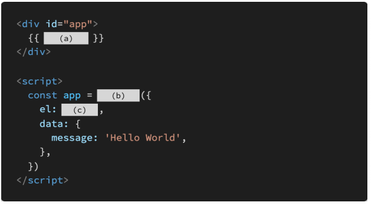
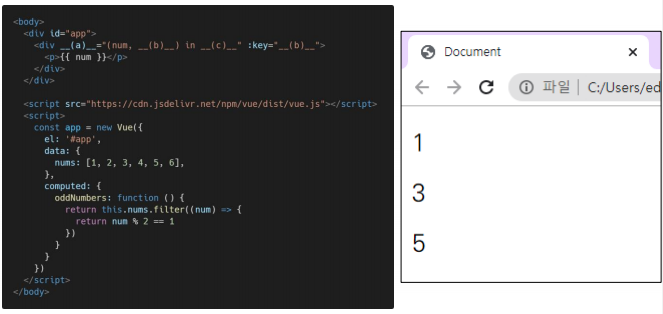

- SPA는 Single Pattern Application의 약자이다

  > False. single Page Applications

- SPA는 웹 애플리케이션에 필요한 모든 정적 리소스를 한 번에 받고, 이후부터는 페이 지 갱신에 필요한 데이터만 전달받는다

  > True

- Vue.js에서 말하는 ‘반응형’은 데이터가 변경되면 이에 반응하여, 연결된 DOM이 업 데이트되는 것을 의미한다

  > True

## 문제 2

MVVM은 무엇의 약자이고, 해당 패턴에서 각 파트의 역할은 무엇인지 간단히 서술하시 오.

Model : JS object. Vue instance 내부에서 data로 사용됨. 값이 바뀌면 View(DOM)이 반응

View : DOM(HTML). Data 변화에 따라 바뀜

View Model : Vue instance. View와 Model 사이 Data와 DOM에 관련된 모든 일을 처리

## 문제 3

> (a) : message
>
> (b) : new Vue
>
> (c) : '#app'

## 문제 4

- 동일한 요소에 v-for와 v-if 두 디렉티브가 함께 작성된 경우,  매 반복 시에 v-if의 조건문으로 요소의 렌더링 여부를 결정한다

  > True

- v-bind 디렉티브는 “@“, v-on 디렉티브는 “:” shortcut(약어)을 제공한다

  > False. 반대로 하면 됨

- v-model 디렉티브는 input, textarea, select 같은 HTML 요소와 단방향 데이터 바인딩을 이루기 때문에 v-model 속성값의 제어를 통해 값을 바꿀 수 있다.

  > False. 양방향 데이터 바인딩을 이룬다. 

## 문제 5

computed와 watch의 개념과 그 차이에 대해서 간단히 서술하시오.

> computed : data로 부터 계산된 어떤 값을 다른 곳에서 사용할 필요가 있을 때
>
> watch : data의 어떤 값이 변하면 어떤 동작이 필요할 때

## 문제 6

다음은 홀수 데이터만 렌더링하는 Vue Application의 예시이다. 빈칸 (a), (b), (c)에 들어갈 코드를 작성하시오

> (a) : v-for
>
> (b) : index
>
> (c) : oddNumbers