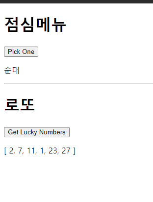

# 0506 workshop


## 문제 1번

```html
<!DOCTYPE html>
<html lang="en">
<head>
  <meta charset="UTF-8">
  <meta http-equiv="X-UA-Compatible" content="IE=edge">
  <meta name="viewport" content="width=device-width, initial-scale=1.0">
  <title>Document</title>
</head>
<body>
  <div id="app">
    <h1>점심메뉴</h1>
    <button @click="onClick">Pick One</button>
    <p>{{ menu }}</p>
    <hr>
    <h1>로또</h1>
    <button @click="lottoClick">Get Lucky Numbers</button>
    <p>{{ lottoNums }}</p>
  </div>

  <script src="https://cdn.jsdelivr.net/npm/vue/dist/vue.js"></script>
  <script src="https://cdn.jsdelivr.net/npm/lodash@4.17.21/lodash.min.js"></script>
  <script>
    const range1 = _.range(1,46)
    const menus = ['국밥','소머리','순대']
    const app = new Vue({
      el: '#app',
      data: {
        menu: '',
        lottoNums: '',
      },
      methods: {
        onClick () {
          var chosenNumber = Math.floor(Math.random() * menus.length);
          this.menu = menus[chosenNumber]
        },
        lottoClick () {
          this.lottoNums = _.sampleSize(range1, 6)
        },
      },
    })
  </script>
</body>
</html>
```




