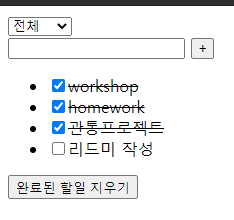

# 0506 workshop


## 문제 1번

```html
<!DOCTYPE html>
<html lang="en">
<head>
  <meta charset="UTF-8">
  <meta http-equiv="X-UA-Compatible" content="IE=edge">
  <meta name="viewport" content="width=device-width, initial-scale=1.0">
  <title>Document</title>
</head>
<body>
  <div id="app">
    <h1>점심메뉴</h1>
    <button @click="onClick">Pick One</button>
    <p>{{ menu }}</p>
    <hr>
    <h1>로또</h1>
    <button @click="lottoClick">Get Lucky Numbers</button>
    <p>{{ lottoNums }}</p>
  </div>

  <script src="https://cdn.jsdelivr.net/npm/vue/dist/vue.js"></script>
  <script src="https://cdn.jsdelivr.net/npm/lodash@4.17.21/lodash.min.js"></script>
  <script>
    const range1 = _.range(1,46)
    const menus = ['국밥','소머리','순대']
    const app = new Vue({
      el: '#app',
      data: {
        menu: '',
        lottoNums: '',
      },
      methods: {
        onClick () {
          var chosenNumber = Math.floor(Math.random() * menus.length);
          this.menu = menus[chosenNumber]
        },
        lottoClick () {
          this.lottoNums = _.sampleSize(range1, 6)
        },
      },
    })
  </script>
</body>
</html>
```


## 문제 2

```html
<!DOCTYPE html>
<html lang="en">
<head>
  <meta charset="UTF-8">
  <meta http-equiv="X-UA-Compatible" content="IE=edge">
  <meta name="viewport" content="width=device-width, initial-scale=1.0">
  <title>Document</title>
  <style>
    .completed {
      text-decoration: line-through;
    }
  </style>
</head>
<body>
  <div id="app">
    <select v-model="filter">
      <option>전체</option>
      <option>진행중</option>
      <option>완료</option>
    </select>
    <form @submit.prevent="addTodo">
      <input type="text" v-model="todoInput">
      <button>+</button>
    </form>
    <ul>
      <li v-for="todo in filteredTodos" :class="{completed: todo.isCompleted}" :key="todo.id"> <!-- 'v-for' 쓸때 :key는 항상 넣어줘라!-->
        <input type="checkbox" v-model="todo.isCompleted">{{ todo.content }}
      </li>
    </ul>
    <button @click="removeCompleted">완료된 할일 지우기</button>
  </div>

  <!-- 
    시간에 따라 변하는 것 (data로 관리해야 하는 것)
    1. select의 option에 따라 보여주는 창이 변함
    2. li 태그도 변함
    3. input을 만들었으면 사용자가 입력한 값도 data로 관리해야 함
   -->

  <script src="https://cdn.jsdelivr.net/npm/vue/dist/vue.js"></script>
  <script src="https://cdn.jsdelivr.net/npm/lodash@4.17.21/lodash.min.js"></script>
  <script>
    const app = new Vue({
      el: '#app',
      data: {
        filter: '전체',
        todoInput: '',
        todos: [
          { 
            id: 1,
            content: '첫 할일', 
            isCompleted: false,
          },
          { 
            id: 2,
            content: '두번째 할일', 
            isCompleted: true,
          },
        ],
      },
      methods: {
        addTodo() {
          // form -> input에 적힌 값을 가지고 todos에 추가!
          const newTodo = {
            id: Date.now(),
            content: this.todoInput,
            isCompleted: false
          }
          this.todos.push(newTodo)
          this.todoInput = ''
        },
        removeCompleted() {
          // todo들 중에서 isCompleted === true
          // 인것들 빼고 다시 todos 구성!
          this.todos = this.todos.filter((todo)=>{
            return todo.isCompleted === false
          })
          //   if (todo.isCompleted === false) {
          //     return true
          //   }else{
          //     return false
          //   }
          // })
          
        },
      },
      computed: {
        filteredTodos() {
          // filter 값을 통해서 todos를 필터링한 배열을 만들 것이다 // computed는 항상 boolean 값을 리턴
          return this.todos.filter((todo)=>{
            if (this.filter === '전체') {
              return true
            }else if(this.filter === '완료') {
              return todo.isCompleted === true
            }else{
              return todo.isCompleted === false
            }
          })
          
        },
      },
      watch: {
        todos: {
          handler () {
            // this.todos를 local storage에 저장
            localStorage.setItem('todos', JSON.stringify(this.todos))
          },
          deep: true,
        },
      },
      created () {
        // local storage에 저장된게 있으면
        // todos에 할당
        if (localStorage.getItem('todos')) {
          this.todos = JSON.parse(localStorage.getItem('todos'))
        }
      }
    })
  </script>
</body>
</html>
```

