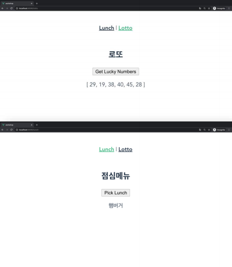

# 0510 workshop

##### `Vue CLI와 Vue Router를 활용하여 점심메뉴, 로또 앱을 완성하시오`



#### `App.vue`

```vue
<template>
  <div id="app">
    <div id="nav">
      <router-link to="/lunch">런치</router-link> |
      <router-link to="/Lotto">로또</router-link>
    </div>
    <router-view/>
  </div>
</template>

<style>
#app {
  font-family: Avenir, Helvetica, Arial, sans-serif;
  -webkit-font-smoothing: antialiased;
  -moz-osx-font-smoothing: grayscale;
  text-align: center;
  color: #2c3e50;
}

#nav {
  padding: 30px;
}

#nav a {
  font-weight: bold;
  color: #2c3e50;
}

#nav a.router-link-exact-active {
  color: #42b983;
}
</style>

```


#### `index.js`

```javasc
import Vue from 'vue'
import VueRouter from 'vue-router'
import Lunch from '../views/Lunch.vue'
import Lotto from '../views/Lotto.vue'

Vue.use(VueRouter)

const routes = [
  {
    path: '/lunch',
    name: 'Lunch',
    component: Lunch
  },
  {
    path: '/lotto',
    name: 'Lotto',
    component: Lotto
  },
]

const router = new VueRouter({
  mode: 'history',
  base: process.env.BASE_URL,
  routes
})

export default router

```


#### `Lotto.vue`

```vue
<template>
  <div>
    <h2>로또</h2>
    <button @click="selectNumbers">로또번호가져오기</button>
    <p>{{ selectedNumbers }}</p>
  </div>
</template>

<script>
import _ from 'loadash'

export default {
  name: 'Lotto',
  data () {
    return {
      selectedNumbers: [],
    }
  },
  methods: {
    selectNumbers () {
      const pool = _.range(1,45)
      this.selectedNumbers = _.sampleSize(pool, 6)
    },
  },
}
</script>

<style>

</style>
```


#### `Lunch.vue`

```vue
<template>
  <div>
    <h2>점심메뉴</h2>
    <button @click="selectLunch">Pick Lunch</button>
    <p>{{ selectedMenu }}</p>
  </div>
</template>

<script>
import _ from 'loadash'

export default {
  name: 'Lunch', // 이건 사실 정하지 않아도 안적어도 상관없다
  data () {
    return {
      selectedMenu: '뭐가나올까',
    }
  },
  methods: {
    selectLunch () {
      const lunches = ['싸이버거','베토디','통새우와퍼']
      this.selectedMenu = _.sample(lunches)
    }
  },
}
</script>

<style>

</style>
```

