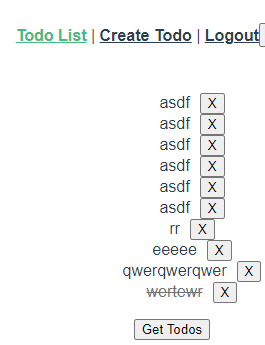

# 0517 workshop

`사전 제공된 django와 vue 프로젝트를 통해 Todo를 가져오는 과정에서 발생하는 CORS 관련 이슈를 해결하고 Todo의 작성/수정(취소선 토글)/삭제를 구현하시오.`

## Todo 작성

`TodoList.vue`

```vue
<template>
  <div>
    <ul>
      <li v-for="(todo, idx) in todos" :key="idx">
        <span @click="updateTodoStatus(todo)" :class="{ completed: todo.completed }">{{ todo.title }}</span>
        <button @click="deleteTodo(todo)" class="todo-btn">X</button>
      </li>
    </ul>
    <button @click="getTodos">Get Todos</button>
  </div>
</template>

<script>
import axios from 'axios'

export default {
  name: 'TodoList',
  data: function () {
    return {
      todos: [],
    }
  },
  methods: {
    getTodos: function () {
      axios({
        method: 'get',
        url: 'http://127.0.0.1:8000/todos/',
        headers: {
            Authorization: `JWT ${localStorage.getItem('jwt')}`
        },
      })
        .then((res) => {
          console.log(res)
          this.todos = res.data
        })
        .catch((err) => {
          console.log(err)
        })
    },
    deleteTodo: function (todo) {
      axios({
        method: 'delete',
        url: `http://127.0.0.1:8000/todos/${todo.id}/`,
        headers: {
            Authorization: `JWT ${localStorage.getItem('jwt')}`
        },
      })
        .then((res) => {
          console.log(res)
          this.getTodos()
        })
        .catch((err) => {
          console.log(err)
        })
    },
    updateTodoStatus: function (todo) {
      const todoItem = {
        ...todo,
        completed: !todo.completed
      }

      axios({
        method: 'put',
        url: `http://127.0.0.1:8000/todos/${todo.id}/`,
        headers: {
            Authorization: `JWT ${localStorage.getItem('jwt')}`
        },
        data: todoItem,
      })
        .then((res) => {
          console.log(res)
          todo.completed = !todo.completed
        })
      },
    },
  created: function () {
    this.getTodos()
  }
}
</script>

<style scoped>
  .todo-btn {
    margin-left: 10px;
  }

  .completed {
    text-decoration: line-through;
    color: rgb(112, 112, 112);
  }
</style>

```

`CreateTodo`

```vue
<template>
  <div>
    <input type="text" v-model.trim="title" @keyup.enter="createTodo">
    <button @click="createTodo">+</button>
  </div>
</template>

<script>
import axios from'axios'

export default {
  name: 'CreateTodo',
  data: function () {
    return {
      title: '',
    }
  },
  methods: {
    createTodo: function () {
      const todoItem = {
        title: this.title,
      }

      if (todoItem.title) {
        axios({
          method: 'post',
          url: 'http://127.0.0.1:8000/todos/',
          data: todoItem,
          headers: {
            Authorization: `JWT ${localStorage.getItem('jwt')}`
          },
        })
          .then((res) => {
            console.log(res)
            this.$router.push({ name: 'TodoList' })
          })
          .catch((err) => {
            console.log(err)
          })
        }
    },
  },
  
}
</script>

```



