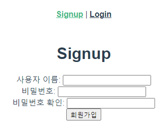
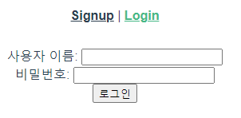
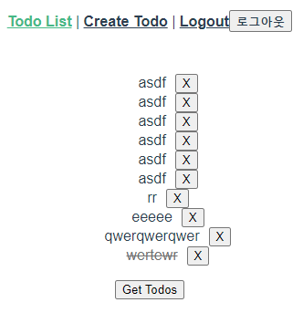

# 0518 workshop

`이전 워크샵 프로젝트에 이어서 JWT를 사용해 로그인과 로그아웃 그리고 인증된 사용자만 Todo API를 이용할 수 있도록 프로젝트를 구현하시오.`

##### `Login.vue`

```vue
<template>
  <div>
    <form @submit.prevent="login">
      <div>
        <label for="username">사용자 이름: </label>
        <input type="text" id="username" v-model="username">
      </div>
      <div>
        <label for="password">비밀번호: </label>
        <input type="password" id="password" v-model="password">
      </div>
      <button>로그인</button>
    </form>
  </div>
</template>

<script>
import axios from 'axios'

// const SERVER_URL = process.env.VUE_APP_SERVER_URL

export default {
  name: 'Login',
  data: function () {
    return {
      username: '',
      password: '',
    }
  },
  methods: {
    login: function () {
      // 서버에다가 로그인 요청하기
      // 응답으로 토큰이 올건데
      // 인증이 필요한 요청때마다 같이 보내줘야함!
      // 그래서 토큰을 저장을 해놔야 함!
      // data?(세션 초기화(새로고침)하면 날아가서 안됨 X), localstorage!!
      // 앱이 로그인된 상태이다! 
      axios({
        url: 'http://127.0.0.1:8000/accounts/login/',
        method: 'post',
        data: {
          username: this.username,
          password: this.password,
        },
      }).then((res)=>{
        // res에 들었는 token 세팅! -> localstorage에 token을 저장하는 일!
        console.log(res)
        localStorage.setItem('jwt', res.data.token)
        this.$emit('login')
        this.$router.push({ name: 'TodoList' })
      }).catch((err)=>{
        // 이미 존재하는 username인 경우 경고창 뜸
        // alert(JSON.stringify(error.response.data))
        alert(err.response.data)
      })

    }
  }
}
</script>

```

##### `Signup.vue`

```vue
<template>
  <div>
    <h1>Signup</h1>
    <form @submit.prevent="signup">
      <div>
        <label for="username">사용자 이름: </label>
        <input type="text" id="username" v-model="username">
      </div>
      <div>
        <label for="password">비밀번호: </label>
        <input type="password" id="password" v-model="password">
      </div>
      <div>
        <label for="passwordConfirmation">비밀번호 확인: </label>
        <input type="password" id="passwordConfirmation" v-model="passwordConfirmation">
      </div>
      <button>회원가입</button>
    </form>
  </div>
</template>

<script>
import axios from 'axios'

// 이게 뭐고
// const SERVER_URL = process.env.VUE_APP_SERVER_URL

export default {
  name: 'Signup',
  data: function () {
    return {
      // credentials: {
      //   username: '',
      //   password: '',
      //   passwordConfirmation: '',
      // },
      username: '',
      password: '',
      passwordConfirmation: '',
    }
  },
  methods: {
    signup: function () {
      // 서버에 회원가입 요청
      axios({
        url: 'http://127.0.0.1:8000/accounts/signup/',
        method: 'POST',
        data: {
          username: this.username,
          password: this.password,
          passwordConfirmation: this.passwordConfirmation,
        },
      }).then(()=>{
        // 회원가입을 성공하면 로그인 페이지로 이동
        this.$router.push({name: 'Login'})
      }).catch((error)=>{
        // 이미 존재하는 username인 경우 경고창 뜸
        alert(JSON.stringify(error.response.data))
      })
    }
  }
}
</script>

```

##### `CreateTodo.vue`

```vue
<template>
  <div>
    <input type="text" v-model.trim="title" @keyup.enter="createTodo">
    <button @click="createTodo">+</button>
  </div>
</template>

<script>
import axios from'axios'

export default {
  name: 'CreateTodo',
  props: {
    isLogin: {
      type: Boolean,
    },
  },
  data: function () {
    return {
      title: '',
    }
  },
  methods: {
    createTodo: function () {
      const todoItem = {
        title: this.title,
      }
      if (todoItem.title) {
        axios({
          method: 'post',
          url: 'http://127.0.0.1:8000/todos/',
          data: todoItem,
          headers: {
            Authorization: `JWT ${localStorage.getItem('jwt')}`
          },
        })
          .then((res) => {
            console.log(res)
            this.$router.push({ name: 'TodoList' })
          })
          .catch((err) => {
            console.log(err)
          })
        }
    },
  },
  created () {
    if (!this.isLogin) {
      alert('로그인하세요')
      this.$router.push({ name:'Login'})
    }
  }
}
</script>

```

##### `TodoList.vue`

```vue
<template>
  <div>
    <ul>
      <li v-for="(todo, idx) in todos" :key="idx">
        <span @click="updateTodoStatus(todo)" :class="{ completed: todo.completed }">{{ todo.title }}</span>
        <button @click="deleteTodo(todo)" class="todo-btn">X</button>
      </li>
    </ul>
    <button @click="getTodos">Get Todos</button>
  </div>
</template>

<script>
import axios from 'axios'

export default {
  name: 'TodoList',
  data: function () {
    return {
      todos: [],
    }
  },
  methods: {
    getTodos: function () {
      axios({
        method: 'get',
        url: 'http://127.0.0.1:8000/todos/',
        headers: {
            Authorization: `JWT ${localStorage.getItem('jwt')}`
        },
      })
        .then((res) => {
          console.log(res)
          this.todos = res.data
        })
        .catch((err) => {
          console.log(err)
        })
    },
    deleteTodo: function (todo) {
      axios({
        method: 'delete',
        url: `http://127.0.0.1:8000/todos/${todo.id}/`,
        headers: {
            Authorization: `JWT ${localStorage.getItem('jwt')}`
        },
      })
        .then((res) => {
          console.log(res)
          this.getTodos()
        })
        .catch((err) => {
          console.log(err)
        })
    },
    updateTodoStatus: function (todo) {
      const todoItem = {
        ...todo,
        completed: !todo.completed
      }

      axios({
        method: 'put',
        url: `http://127.0.0.1:8000/todos/${todo.id}/`,
        headers: {
            Authorization: `JWT ${localStorage.getItem('jwt')}`
        },
        data: todoItem,
      })
        .then((res) => {
          console.log(res)
          todo.completed = !todo.completed
        })
      },
    },
  created: function () {
    this.getTodos()
  }
}
</script>

<style scoped>
  .todo-btn {
    margin-left: 10px;
  }

  .completed {
    text-decoration: line-through;
    color: rgb(112, 112, 112);
  }
</style>

```

<br>

## 결과화면

##### `회원가입`



##### `로그인`



##### `TodoList`



