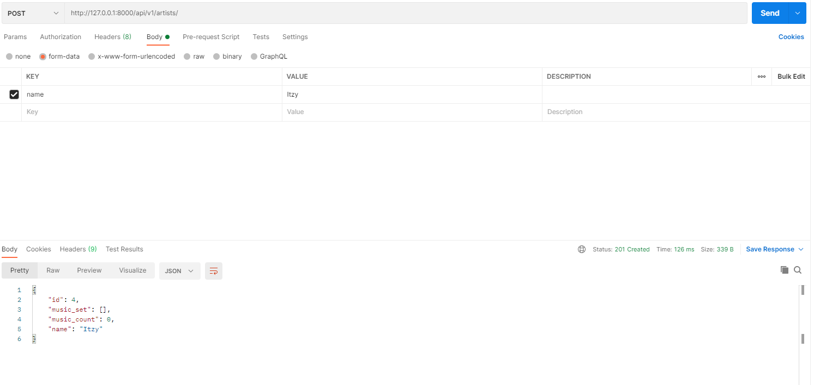
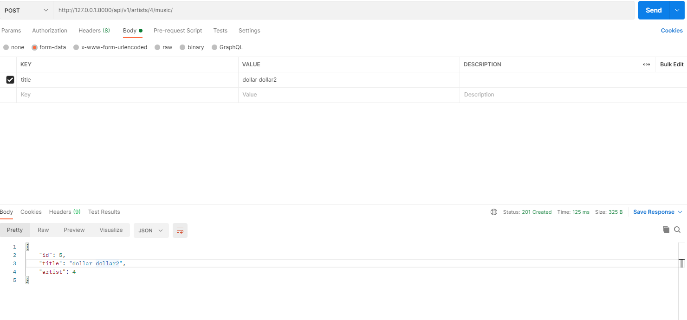
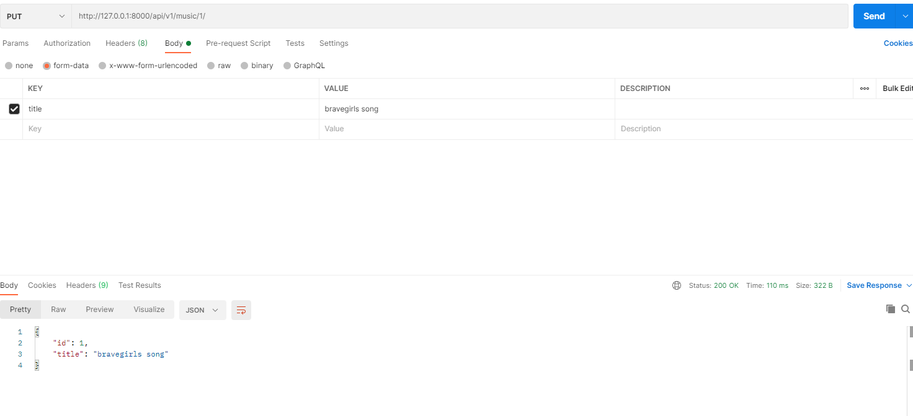

# 0427 workshop

##### `serializers.py`

```python
from rest_framework import serializers
from .models import Artist, Music

class MusicListSerializer(serializers.ModelSerializer):

    class Meta:
        model = Music
        fields = ('id', 'title')


class MusicSerializer(serializers.ModelSerializer):

    class Meta:
        model = Music
        fields = '__all__'
        read_only_fields = ('artist',)


class ArtistSerializer(serializers.ModelSerializer):

    class Meta:
        model = Artist
        fields = ('id', 'name', 'music_set', 'music_count')
        

class ArtistListSerializer(serializers.ModelSerializer):
    music_set = MusicSerializer(many=True, read_only=True)
    music_count = serializers.IntegerField(
        source='music_set.count', 
        read_only=True
    )

    class Meta:
        model = Artist
        fields = '__all__'

```


##### `views.py`

```python
from rest_framework.response import Response
from rest_framework.decorators import api_view
from rest_framework import status
from django.shortcuts import render, get_list_or_404, get_object_or_404

from .models import Artist, Music
from .serializers import (
    MusicListSerializer,
    MusicSerializer,
    ArtistListSerializer,
    ArtistSerializer
)

# Create your views here.
@api_view(['GET', 'POST'])
def artist_list(request):
    artists = get_list_or_404(Artist)
    if request.method == 'GET':
        serializer = ArtistListSerializer(artists, many=True)
        return Response(serializer.data)

    elif request.method == 'POST':
        serializer = ArtistListSerializer(data=request.data)
        if serializer.is_valid(raise_exception=True):
            serializer.save()
            return Response(serializer.data, status=status.HTTP_201_CREATED)
        return Response(serializer.errors, status=status.HTTP_400_BAD_REQUEST)


@api_view(['GET', 'PUT', 'DELETE'])
def artist_detail(request, artist_pk):
    artist = get_object_or_404(Artist, pk=artist_pk)
    if request.method == 'GET':
        serializer = ArtistListSerializer(artist)
        return Response(serializer.data)

    elif request.method == 'PUT':
        serializer = ArtistListSerializer(artist, data=request.data)
        if serializer.is_valid(raise_exception=True):
            serializer.save()
            return Response(serializer.data)

    elif request.method == 'DELETE':
        artist.delete()
        data = {
            'delete': f'{artist_pk}번 artist가 삭제되었습니다',
        }
        return Response(data, status=status.HTTP_204_NO_CONTENT)
    

@api_view(['POST'])
def artist_new_music(request, artist_pk):
    artist = get_object_or_404(Artist, pk=artist_pk)
    serializer = MusicSerializer(data=request.data)
    if serializer.is_valid(raise_exception=True):
        serializer.save(artist=artist)
        return Response(serializer.data, status=status.HTTP_201_CREATED)
    return Response(serializer.errors, status=status.HTTP_400_BAD_REQUEST)


@api_view(['GET'])
def music_list(request):
    musics = get_list_or_404(Music)
    serializer = MusicListSerializer(musics, many=True)
    return Response(serializer.data)


@api_view(['GET', 'PUT', 'DELETE'])
def music_detail(request, music_pk):
    music = get_object_or_404(Music, pk=music_pk)
    if request.method == 'GET':
        serializer = MusicListSerializer(music)
        return Response(serializer.data)

    elif request.method == 'PUT':
        serializer = MusicListSerializer(music, data=request.data)
        if serializer.is_valid(raise_exception=True):
            serializer.save()
            return Response(serializer.data)

    elif request.method == 'DELETE':
        music.delete()
        data = {
            'delete': f'{music_pk}번 music이 삭제되었습니다',
        }
        return Response(data, status=status.HTTP_204_NO_CONTENT)
```


##### `GET & POST api/v1/artists/`


새로운 아티스트 Itzy 추가



##### `GET api/v1/artists/<artist_pk>/`


##### `POST api/v1/artists/<artist_pk>/music/`




##### `GET api/v1/music/`


##### `GET & PUT & DELETE  api/v1/music/<music_pk>/`



