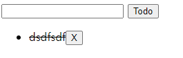

# 0429 workshop


## 코드

```html
<!DOCTYPE html>
<html lang="en">
<head>
  <meta charset="UTF-8">
  <meta http-equiv="X-UA-Compatible" content="IE=edge">
  <meta name="viewport" content="width=device-width, initial-scale=1.0">
  <title>Document</title>
  <style>
    .done {
      text-decoration: line-through;
    }
  </style>
</head>
<body>
  <form action="/todos/">
    <input type="text">
    <button>Todo</button>
  </form>
  <ul></ul>

<script>
  const form = document.querySelector('form')

  function addTodo (event) {
    // 이벤트를 취소한다.
    event.preventDefault()

    // input element와 input element의 value 값을 저장한다.
    const input = document.querySelector('input')

    if (input.value.length > 0) {
      // li element를 생성 후 input element의 value 값을 데이터로 저장한다
      const Li = document.createElement('li')
      Li.innerText = input.value

      // ul 태그의 자식 태그로 위에서 생성한 li element를 넣는다.
      const ul = document.querySelector('ul')
      ul.appendChild(Li)
      

      // 삭제 버튼을 생성 후 li 태그의 자식 태그로 넣는다.
      const deleteButton = document.createElement('button')
      deleteButton.innerText = 'X'
      Li.appendChild(deleteButton)

      // 삭제 버튼을 클릭하면 해당 li element를 삭제한다
      // deleteButton.addEventListener('click', (e) => e.target.parentNode.remove(), false)
      deleteButton.addEventListener('click', () => {
        Li.remove()
      })

      // li element를 클릭하면 취소선이 토글된다.
      Li.addEventListener('click', () => {
        // Li.style.textDecoration = 'line-through'
        // done이라고 하는 클래스를 추가할건데
        // done클래스가 없으면 추가하고
        // 없으면 빼야 한다
        // if (Li.classList.contains('done')) {
        //   Li.classList.remove('done')
        // }else{
        //   Li.classList.add('done')
        // }
        Li.classList.toggle('done')
      })

      input.value = ''
    }else{
      alert('빈값이야 임마!')
    }
  }

  form.addEventListener('submit', addTodo)
</script>
</body>
</html>

```


## 완성 화면

