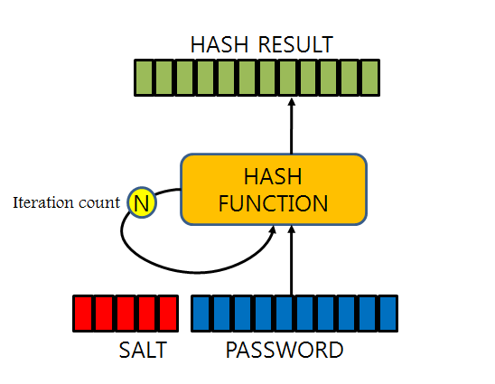

# User

Django에서 기본적으로 User 객체의 password 저장에 사용하는 알고리즘, 그리고 함께 사용된 해시 함수

> 알고리즘 : PBKDF2 algorithm
>
> 해시함수 : SHA256 hash

#### 번외

---

##### `PBKDF2 (Password-Based Key Derivation Function)`

사용자의 암호를 저장할 때 SALT라는 임의의 문자열을 PASSWORD에 붙여 DIGEST를 만든다고 한다. 만약 해킹을 시도해 암호를 알아내려면 이 DIGEST와 비교했을 때 일치해야 하므로 임의의 문자열이 뭔지 알아내야 한다.

하지만 이 방법도 HW의 연산이 빠르면 취약한 점이 있다고 한다.

그래서 이 DIGEST를 만드는 해싱을 임의의 횟수 N번을 해서 저장하는 방식이 PBKDF2다.

구현이 쉽고, 보안성이 뛰어나 미국표준기술연구소(NIST)에서도 승인한 알고리즘이다.

`DIGEST = PBKDF2(PRF, Password, Salt, c, DLen)  `

- PRF: 난수(예: HMAC)
- Password: 패스워드
- Salt: 암호학 솔트
- c: 원하는 iteration 반복 수
- DLen: 원하는 다이제스트 길이

위와 같은 파라미터가 필요한데, 위의 c가 임의의 횟수로 반복적인 해싱을 일어나게 만드는 파라미터다. 기본적으로 1000번? 이상 해준다고 함

여기서 `해싱`은 임의의 크기를 가진 데이터를 고정된 크기로 변환시키는 알고리즘인데 앞에 SALT와 PASSWORD를 합쳐 DIGEST를 만들 때 고정된 크기의 DIGEST를 만들기 위한 변환 과정이라고 이해했는데 맞는지는 모르겠다.

