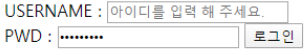

# 2021.02.02 homework

## 문제 1

Q. 보기 중 콘텐츠의 의미를 명확히 하기 위해 HTML5에서 새롭게 추가된 시맨틱(semantic) 태그를 모두 고르시오

```html
div, header, h1, section, footer, a, form, span
```

A.

header, section, footer


## 문제 2

Q.아래 이미지와 같이 로그인 Form을 생성하는 HTML코드를 작성하시오. 단, USERNAME 글자를 클릭하면 아이디를 입력하는 input에, PWD 글자를 클릭하면 비밀번호를 입력하는 input에 focusing 되도록 하시오.



A.

```html
<!DOCTYPE html>
<html lang="en">
<head>
  <meta charset="UTF-8">
  <meta name="viewport" content="width=device-width, initial-scale=1.0">
  <title>Document</title>
</head>
<body>
  <section>
    <form action="#">
      <div>
        <label for="name">USERNAME : </label>
        <input type="text" id="name" placeholder="아이디를 입력해주세요">
        <label onclick="name"></label>
      </div>
      <div>
        <label for="pw">PWD : </label>
        <input type="text" id="pw" name="name" placeholder="********">
        <input type="submit" value="로그인">
        <label onclick="pw"></label>
      </div>
    </form>
  </section>
</body>
</html>
```


## 문제 3

Q. 크기 단위 em은 요소에 지정된 상속된 사이즈나 기본 사이즈에 대해 상대적인 사이즈를 설정한다. 즉, 상속의 영향으로 사이즈가 의도치 않게 변경될 수 있는데 이를 예방하기 위해 HTML 최상위 요소의 사이즈를 기준으로 삼는 크기 단위는 무엇인가?

A. 

`rem`


## 문제 4

Q. 다음 예제를 통해 ‘자손 결합자’와 ‘자식 결합자’의 차이를 설명하시오.

```html
div p {
  color: crimson;
}

div > p {
  color: crimson;
}

```

A.

자손 결합자 : 공백으로 표현. 자손의 p태그 전부 지정.

- div 부모태그 안에 있는 모든 p태그를 crimson 색으로 만든다

자식 결합자 : >로 표현. 자손 중 직접적으로 p태그만을 지정

- div 부모태그와 직접적인 경로에 있는 p태그만 crimson 색으로 만든다