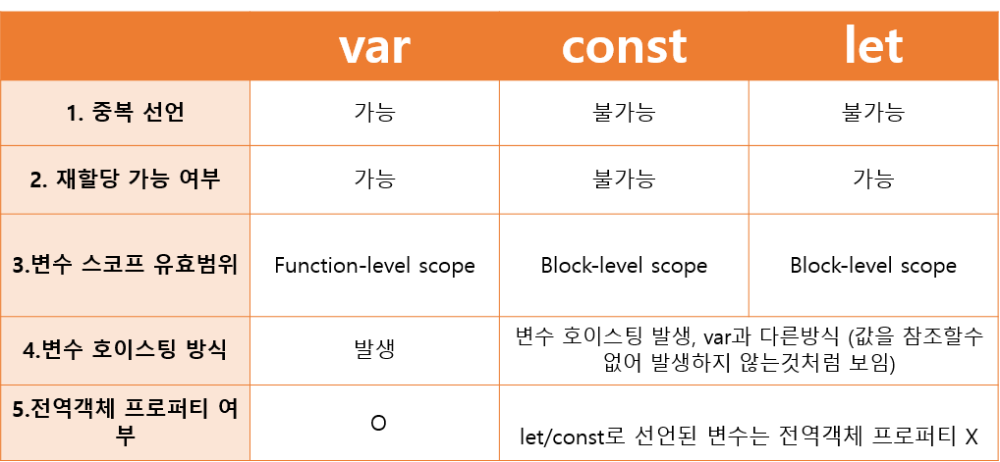

# 0429 homework

## JS

 

#### `let / const / var`

 

#### `javascript 특징`

- “값이 없음”을 표현하는 값으로 null과 undefined 두 종류가 있으며, 둘 다 typeof 연산자에서 undefined가 반환된다

- 배열의 각 요소를 순회하고 싶으면 `for of`를 써라
- ‘==’ 연산자는 두 변수의 값이 같은지 비교. 값이 같고 타입이 다르면 형변환이 일어나 같다고 나옴
- '===' 연산자는 두 변수의 값과 타입이 같은지 비교
- JavaScript에서 함수는 변수에 할당, 인자로 전달할 수 있으나 함수의 결과값으로 반 환할 수는 없다

 

#### `Array Helper Method`

- forEach - 배열의 요소를 하나씩 순회한다

- map : 모든 인자에 규칙을 적용해 만든 배열을 return
- filter : 배열에서 규칙에 부합하는 인자로 이루어진 배열을 return
- find : 배열에서 특정 값의 인자를 찾는 메소드
- every : 내가 전달한 조건을 전부 만족하는지. boolean
- some : 내가 전달한 조건을 하나라도 만족하는지. boolean
- reduce : 순회한 요소를 가지고 하나의 값으로 만들어줌

 