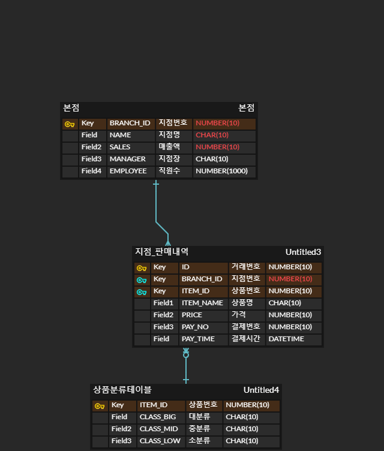

# 0330 homework

#### `ERD`




#### `models`

```python
# 본점
class Headoffice(models.Model):
    branch_id = models.IntegerField()
    name = models.CharField(max_length=10)
    sales = models.IntegerField()
    manager = models.CharField(max_length=10)
    employee = models.IntegerField()

# 지점판매내역
class BranchSales(models.Model):
    branch = models.ForeignKey(Headoffice, on_delete=models.CASCADE)
    item = models.ForeignKey(ItemTable, on_delete=models.CASCADE)
    item_name = models.CharField(max_length=10)
    price = models.IntegerField()
    pay_no = models.IntegerField()
    pay_time = models.models.DateTimeField(auto_now_add=False)

# 상품분류테이블
class ItemTable(models.Model):
    item_id = models.IntegerField()
    class_big = models.CharField(max_length=10)
    class_mid = models.CharField(max_length=10)
    class_low = models.CharField(max_length=10)
```


##### 본점

> - 각 지점들의 매출, 직원을 총 관리하기 위한 테이블
> - 각 지점별로 고유한 지점번호(branch_id)를 가짐


##### 지점판매내역

> - 지점에서 판매한 판매내역을 테이블로 정리
> - 바코드로 상품을 찍으면 거래번호(PK)가 자동으로 생성
> - 본점 테이블의 지점번호와 상품분류테이블의 상품번호를 외래키로 가짐
> - 결제번호는 실제 계산하기 전까지 같은 값을 가짐. 한 사람이 여러 상품을 구매하면 그 상품들은 같은 값을 가질 것


##### 상품분류테이블

> - 각 상품은 고유의 상품번호(ITEM_ID)를 가짐
> - 대/중/소분류로 상품을 분류