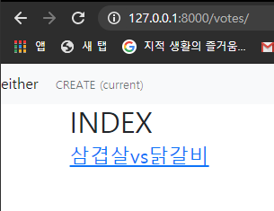
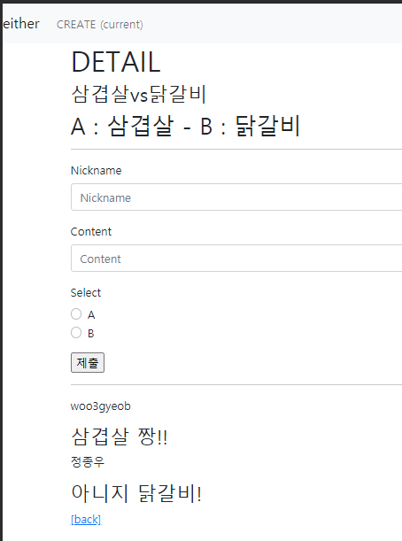

# 0330 workshop

`index`



`detail`




`models`

```python
from django.db import models

# Create your models here.
class Vote(models.Model):
    subject = models.CharField(max_length=100)
    choice_A = models.CharField(max_length=100)
    choice_B = models.CharField(max_length=100)

    def __str__(self):
        return self.subject


class Comment(models.Model):
    nickname = models.CharField(max_length=50)
    vote = models.ForeignKey(Vote, on_delete=models.CASCADE)
    content = models.CharField(max_length=100)
    select = models.BooleanField()

    def __str__(self):
        return self.content
```


`views`

```python
from django.shortcuts import render, redirect, get_object_or_404
from django.views.decorators.http import require_POST, require_safe, require_http_methods
from .forms import VoteForm, CommentForm
from .models import Vote, Comment

@require_safe
def index(request):
    votes = Vote.objects.order_by('-pk')
    context = {
        'votes':votes,
    }
    return render(request, 'votes/index.html', context)


@require_http_methods(['POST','GET'])
def create(request):
    if request.method == 'POST':
        form = VoteForm(request.POST)
        if form.is_valid():
            form.save()
            return redirect('votes:index')
    else:
        form = VoteForm()
    context = {
        'form':form,
    }
    return render(request, 'votes/create.html', context)


@require_safe
def detail(request, vote_pk):
    vote = get_object_or_404(Vote, pk=vote_pk)
    comment_form = CommentForm()
    comments = vote.comment_set.all()
    context = {
        'vote':vote,
        'comment_form':comment_form,
        'comments':comments,
    }
    return render(request, 'votes/detail.html', context)


def comments_create(request, vote_pk):
    comment_form = CommentForm(request.POST)
    if comment_form.is_valid():
        comment = comment_form.save(commit=False)
        comment.vote_id = vote_pk
        comment.save()
    return redirect('votes:detail', vote_pk)
```

