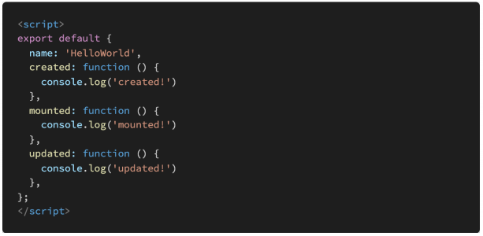

# 0510 homework

## 문제 1

#### `아래의 설명을 읽고 T/F 여부를 작성하시오`

- Vue의 Life Cycle Hook에서 created Hook은 Vue template에 작성한 요소들이 DOM에 다 그려지는 시점에 실행된다

  > False. 
  >
  > 위 설명은 mounted hook에 대한 설명이고, created Hook은 

- npm은 Node Package Manager의 약자이며, npm을 통해 설치한 package 목록은 package.json 파일에 자동으로 작성된다

  > True

- Vue CLI를 통해 만든 프로젝트는 브라우저가 아닌 node.js 환경이기 때문에 DOM 조작이나 Web API 호출 등 Vanilla JS에서의 기능을 사용할 수 없다.

  > False. 
  >
  > node.js 환경인 건 맞다. 하지만 하나의 파일로 만드는 것을 node.js 환경에서 하고, 만든 파일을 작동시키는 건 브라우저에서 작동한다. 그래서 Vanilla JS 기능을 사용할 수 있다

## 문제 2

#### `Vue Router에서 설정하는 history mode가 무엇을 뜻하는지 서술하시오`

A.

router - history API를 사용하게 하는 모드

history.pushState(url)

hashtag

## 문제 3

#### `Vue Life Cycle Hook을 참고하여, 다음 Vue application을 실행했을 때 console 창에 출 력되는 메시지를 작성하시오`

A.

> created!
>
> mounted!
>
> 템플릿이 한 번 다 그려지고 나면 mounted가 실행된다. 
>
> 그리고 데이터에 변경이 생기면 updated hook이 실행된 후 mounted hook이 실행된다.