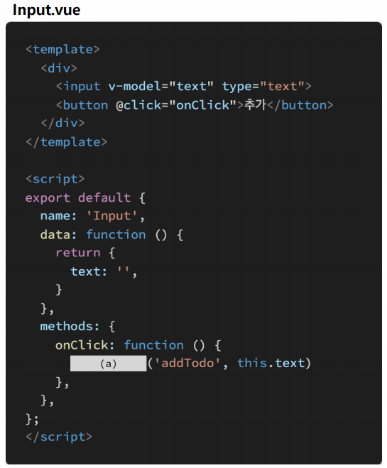
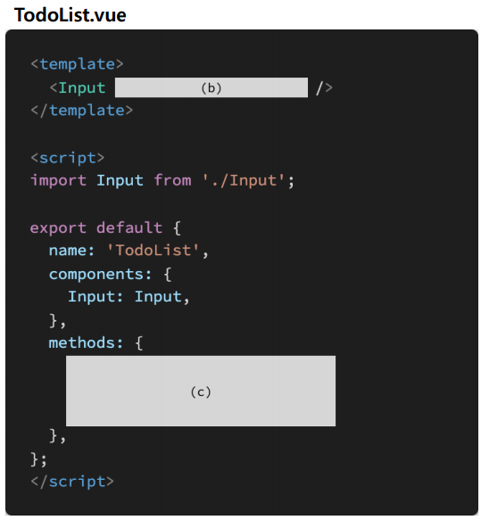

# 0511 homework

## 문제 1

아래의 설명을 읽고 T/F 여부를 작성하시오

- Vue는 컴포넌트 간 양방향 데이터 흐름을 지향하기 때문에 부모, 자식 컴포넌트 간의 데이터 전달 및 수정이 자유롭다

  > False. 
  >
  > 단방향 데이터 흐름을 지향하며, 부모/자식 컴포넌트 간의 데이터 전달 및 수정이 자유롭지 않다

- v-on 디렉티브는 해당 요소 또는 컴포넌트에서 특정 이벤트 발생 시 전달받은 함수 를 실행한다

  > True

- 컴포넌트에서 클릭 이벤트 발생 시 특정 함수를 실행하고자 할 때, @click 혹은 v-on:click 디렉티브를 사용한다

  > True

- 부모 컴포넌트는 props를 통해 자식 컴포넌트에게 이벤트를 보내고 자식 컴포넌트 는 emit을 통해 부모 컴포넌트에게 데이터를 전달한다

  > False
  >
  > 이벤트가 아니라 data를 보낸다

## 문제 2

Vue는 단방향 데이터 흐름을 지향하는 프론트엔드 프레임워크다. 공식문서를 참고하여 그 이유를 서술하시오.

A.

> 컴포넌트가 실수로 부모의 상태를 변경하면 데이트 흐름을 파악하기 어렵기 때문

## 문제 3

다음은 자식 컴포넌트에서 이벤트를 발생시켜 부모 컴퍼넌트의 함수를 실행하는 코드 이다, 빈칸 (a), (b), (c)에 들어갈 코드를 작성하시오

> • Input 컴포넌트의 버튼을 누르면 addTodo 이벤트가 발생한다. (이벤트 발생 시 data의 text 값도 함께 전달한다.) 
>
> • TodoList 컴포넌트에서 addTodo 이벤트가 발생하면, onAddTodo 함수를 실행한 다. 
>
> • onAddTodo 함수에서는 자식 컴포넌트에서 전달받은 값을 console.log 함수를 통해 출력한다

> (a) : `this.$emit`
>
> (b) : `@addTodo="onAddTodo"`
>
> (c) : addTodo (InputValue) {
>
> ​	console.log(InputValue)
>
> }