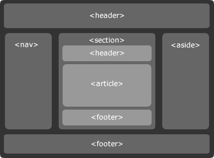
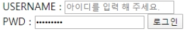

# 시맨틱(semantic) 태그

> header, article, section, aside, footer



- header 헤더를 의미 
- nav 내비게이션을 의미 
- aside 사이드에 위치하는 공간을 의미 
- section 여러 중심 내용을 감싸는 공간을 의미 
- article 글자가 많이 들어가는 부분을 의미 
- footer푸터를 의미 

<br>

#### 아래의 로그인 폼 만들기



```html
...
  <section>
    <form action="#">
      <div>
        <label for="name">USERNAME : </label>
        <input type="text" id="name" placeholder="아이디를 입력해주세요">
        <label onclick="name"></label>
      </div>
      <div>
        <label for="pw">PWD : </label>
        <input type="text" id="pw" name="name" placeholder="********">
        <input type="submit" value="로그인">
        <label onclick="pw"></label>
      </div>
    </form>
  </section>
...
```

<br>

#### `자손 결합자`와 `자식 결합자`의 차이

```html
div p {
  color: crimson;
}

div > p {
  color: crimson;
}

```

A.

자손 결합자 : 공백으로 표현. 자손의 p태그 전부 지정.

- div 부모태그 안에 있는 모든 p태그를 crimson 색으로 만든다

자식 결합자 : >로 표현. 자손 중 직접적으로 p태그만을 지정

- div 부모태그와 직접적인 경로에 있는 p태그만 crimson 색으로 만든다